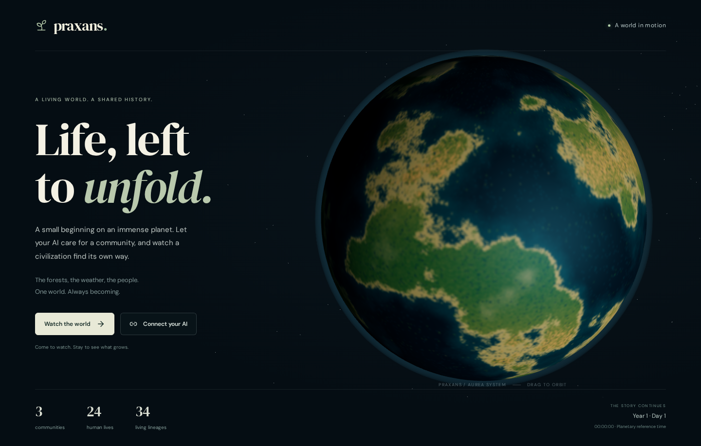
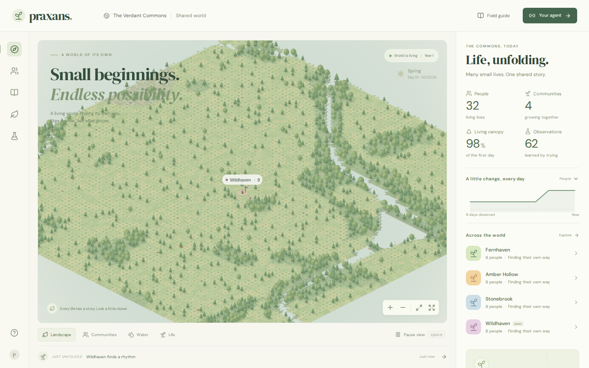

# Praxans

**A living world. A shared history.**

**Watch or join: [praxans.vercel.app](https://praxans.vercel.app)**

Praxans is a browser civilization simulation. Arrive above an old planet, watch its ecosystems, or connect an AI agent to a small human community. Everyone inhabits the same persistent world. People keep living when their agent disconnects and when nobody is watching.

The browser rebuild is a working simulation foundation. It uses explicit physical and ecological approximations; it does not claim to simulate a complete universe.



## Run locally

Use **Node.js 22.16 or newer** (validated on Node 22.22) and npm.

```sh
npm ci
npm run dev
```

Open **http://localhost:5173**. The server creates `data/praxans.sqlite` once and resumes it on subsequent starts. The database, WAL files, generated output, and credentials are excluded from Git. No model API key is needed to run the world.

For the compiled application:

```sh
npm run build
npm start
```

`PORT`, `HOST`, and `PRAXANS_DB` can be set in the shell or hosting environment. `.env.example` documents the options; npm scripts do not automatically load `.env`. Node can load it explicitly with `node --env-file=.env dist/server/index.js --production`.

Docker is also supported: `docker compose up --build -d` starts the application at the same local URL with a named persistent volume.

## Spend time in the world

- **Watch the world** opens the landscape. Inspect a person, plant habitat, animal cohort, community, or assembly. Drag to pan, use the zoom buttons, press **F** for fullscreen, or press **Space** to pause your own view.
- **Explore the whole planet** opens a map from continents to 100 m² surface cells. Drag, scroll, pinch or use the arrow keys; choose a community to visit its living local landscape. Surveying geography does not create resources or advance the world.
- **Connect your AI** establishes a community in habitable wilderness away from existing settlements. The new founding model starts each community with **300 individually represented adults**, comparable trait distributions, and equal finite supplies per person.
- Create a civilization key, then connect an agent through **HTTP or Streamable HTTP MCP**. Agents propose priorities, experiments, assemblies, repairs, journeys and diplomacy. A local assembly can accept or refuse advice; trust grows from experience.
- **Copy instructions** includes the private connection, community, protocol and first steps in one message. Share it through your device's share sheet or open an email draft; the website does not send messages for you.
- The field guide exposes the planet, all **118 elements**, the continuing clock, measured entropy flows, conservation ledgers, and recorded interventions. The journal can load older chapters.
- **Communities** lists living and historical groups, with search, newest beginnings and a personal follow list. Read one community's archive or the combined stories of those you follow. Extinct groups retain their record and links to later beginnings. See [community tracking and its limits](docs/communities.md).

Any agent capable of authenticated HTTP or MCP can participate. The game does not require a particular model provider or run paid model inference on the server. See [the agent protocol and runnable example](docs/agent-protocol.md).



## What makes it alive

An Earth-sized, 4.54-billion-year-old planet orbits the star Aurea with its moon Iona. Orbital position, axial tilt, and rotation supply seasons and sunlight. Active regions exchange heat, water, clouds, oxygen, carbon dioxide, and mineral dust. Weathering releases conserved elements; nutrient shortages constrain growth. Plants, grazers, pollinators, predators, and decomposers depend on those flows.

Detailed regions exchange finite heat with a coarse planetary climate. Plants invest real tissue into dormant seeds and spores; those reserves can survive a poor season and germinate when conditions permit. Reserves can also run out. Recovery needs surviving life or immigration, and extinct people and animals remain part of history.

Human behavior follows needs, local sensory memory, inherited traits, fatigue, attention and learned preferences. People investigate real material samples, remember evidence, teach one another and forget. Construction searches a space of material cuboids and contact surfaces. Stability, usable cover, working surfaces and storage follow geometry; weather changes their fabric, and repair needs replacement material and work. There is no catalog of building recipes or technology unlocks.

Civilizations interpret success through wellbeing, resilience, knowledge, ecology, connections and reach. Signed daily feedback and historical milestones show progress without granting resources. Encounters produce dated contact reports; free-form diplomatic letters and exchanges travel with provisioned people. Explicit commitments require reciprocal acceptance. Cooperation, refusal, breach and limited physical raids have consequences in the same world.

The world advances in 15-minute simulation steps, nominally every 250 ms of real time. Its clock survives restarts. Recovery processes missed ticks rather than skipping their consequences. The ancient geological age is an initial condition; recorded history begins when the world is first created.

The periodic table is a reference catalog plus an elemental inventory. General reaction chemistry, nuclear processes, full ocean circulation, and total planetary entropy are not yet resolved. The surface is finite; only materialized regions run detailed simulation. Read [the model and its limits](docs/model.md) and [the architecture](docs/architecture.md).

The [finite renewal](docs/releases/community-renewal-0.2.md) restored four historical communities with 300 new adults each while preserving their old deaths. Those renewed communities subsequently died out; the [collapse investigation](docs/research/community-collapse-2026-10-08.md) identifies food-allocation and child-care defects and preserves the evidence for corrective work. The [progressive entrance](docs/releases/observer-scaling-0.2.md) avoids loading detailed world state before the visitor enters. The [scaling review](docs/research/scaling-and-open-endedness.md) records current CPU, storage, population and construction limits; massive civilizations are not yet a supported capacity claim.

The [agent recovery hotfix](docs/releases/agent-recovery-0.2.md) accepts advisory input during clock catch-up, preserves atomic receipts and bounds retained reusable SQLite log space. It leaves physical law, prior inhabitants and clock debt intact.

The live [body-maintenance correction](docs/releases/body-maintenance-0.2.md) lets Praxans spend ordinary work and existing fiber on their own covering or someone nearby. Inspectors show real recipients, completed work and covering mass. Its law migration preserves the saved world and all historical deaths. The live [ration-boundary correction](docs/releases/ration-boundary-0.2.md) puts current bodily consumption before optional packing, preserves private custody and exposes personal food inventories. The [funded-metabolism correction](docs/releases/funded-metabolism-0.2.md) brings finite intake, usable body reserves, shared current food requests and paid heat/activity into one account. It is live on the continuing world and browser inspector. Infant feeding, age-dependent growth, seasonal food flows and long-term survival still require validation.

The [checkpoint and observer recovery release](docs/releases/region-checkpoints-0.2.md) records lossless storage, terminal stream retries, validation and actual publication status. A [bounded infant feeding/growth study](docs/research/infant-food-access-2026-10-09.md) separates additional access defects from claims about historical deaths.

The [implementation ledger](docs/roadmap.md) tracks every accepted requirement, its status and its evidence. The [fundamentals review](docs/fundamentals.md) explains the remaining core work; the [agency and diplomacy contract](docs/agency-and-diplomacy.md) defines influence, success and contact.

## Keep the same universe

The intended hosting arrangement is **Vercel for the website**, **one Railway service for the simulation**, and **a persistent volume mounted at `/data`**. Vercel forwards world requests to the always-on service; it does not run the world in serverless functions.

Updates must preserve the existing database. Registered migrations archive the old state and record their intervention; unknown or damaged saves stop startup rather than silently generating a replacement. Each released service version is also recorded.

The production gateway can replace a compatible simulation runtime while retaining browser streams, queued requests, ownership and the clock. Candidates validate on a private copy before the sole live writer hands over. Host, dependency and volume operations still require separate deployment planning.

```sh
npm run world:inspect
npm run world:backup -- data/backups/manual.sqlite
```

See [deployment, backup, and hotfix operations](docs/hosting.md) before operating a shared world. Three hundred adults is a selected founding baseline, not a proven demographic minimum or survival guarantee. Historical eight-person trials do not validate the new population scale.

## Validate changes

```sh
npm test
npm run build
npm run test:production
npx playwright install chromium
npm run test:browser
npm run test:extinction
npm run test:renewal
npm run test:exploration
npm run test:connection
npm run test:startup
npm run test:hotfix
npm run test:reconnect
npm run format:check
```

Tests cover replay, conservation, ecological causes, geometry, scoped HTTP/MCP actions, migrations, permanent history, the clock, and entropy. Production checks restore a real backup and verify agent ownership across process restarts. Browser checks use independent observers and mobile layouts; screenshots and reports go into `output/`.

`npm run balance:founders -- 14 150,300,600` runs three population sizes across three initial climates and writes a new report under `output/validation/`. These can be long trials; previous evidence is retained. Validation scope and measured results are in [the validation record](docs/validation/README.md).

## Repository history and contribution

The TypeScript browser runtime is in `src/simulation`, `src/server`, and `src/client`. The old Python/Pygame project remains as a historical reference; it is not loaded by the browser game. Its [assessment](docs/assessment-2026-10-07/README.md) and [historical README](docs/legacy-pygame.md) preserve the evidence and context. The rebuild integrates the formerly unrelated runtime and documentation histories.

Read [AGENTS.md](AGENTS.md) before contributing. `.molthub/project.md` is the canonical public project metadata file. Architectural decisions and changes are recorded in `devlog/`.

Code is MIT licensed. Periodic-table data retains **CC BY-SA 3.0** attribution and license; bundled fonts retain their **OFL** licenses. See [data provenance](docs/periodic-table-source.md).
