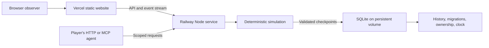

# Browser world architecture

Praxans has one authoritative world process. Browsers observe it; external agents send bounded requests. Neither a browser's frame rate nor a model response controls simulation time.

## Source boundaries

| Location | Responsibility |
| --- | --- |
| `src/simulation/types.ts` | Explicit saved state, snapshots, tick units, format version |
| `world.ts`, `terrain.ts`, `surface.ts` | Initial conditions, seeded planet, region materialization, frontier founding |
| `planet.ts`, `chronology.ts` | Orbits, solar position, moon, calendar, geological epoch |
| `chemistry.ts`, `laws.ts`, `thermodynamics.ts` | Element identities, material balances, biochemical energy, statics, selected entropy flows |
| `weather.ts`, `geology.ts`, `ecology.ts`, `fauna.ts` | Coupled environmental and living processes |
| `citizens.ts`, `economy.ts`, `engine.ts`, `actions.ts` | Needs, learning, work, relationships, ordered updates, bounded agent intervention |
| `src/server/app.ts`, `schema.ts` | HTTP/MCP, scoped authorization, action validation, public snapshots and event streams |
| `store.ts`, `migrations.ts` | Atomic SQLite storage, checksums, archives, ownership lease, recovery clock |
| `src/client/` | Planet entrance, landscape rendering, inspection, history, and agent onboarding |

The historical Python modules and authored content definitions do not participate in the browser runtime.

## Clock ownership and determinism

The world stores a nonnegative integer tick and the seeded PRNG state. One tick represents 900 simulated seconds. The host aims to advance one tick every 250 real milliseconds: one simulated day takes 24 real seconds at full speed. Weather and ecology update hourly; geological changes integrate daily at their much slower physical rates.

A persisted wall-clock checkpoint records how much real time has been processed. After interruption, the server advances every missed tick in bounded batches. It does not jump over hunger, metabolism, births, weather, or other consequences. The public health response reports lag and recovery state; new decisions wait when recovery is more than ten real seconds behind. Very large backlogs and growing worlds can take time to recover.

A database lease prevents two processes from advancing the same saved world. The owner renews it every five seconds; an interrupted owner's lease expires after thirty seconds. Save and clock checkpoint commit together. A graceful stop saves and releases ownership. A fault preserves the last valid checkpoint and makes health fail.

Deterministic replay means the same state, tick sequence, PRNG, laws, and ordered actions produce the same result. Network arrival times and different agent choices are external inputs, not deterministic predictions.

## An immense, finite frontier

The planet uses an equal-area surface projection with longitude wrapping and polar boundaries. A cell covers 100 m²; a region contains 32 × 32 cells. The Earth-sized surface has roughly five trillion possible cells. The first observer window spans 96 × 96 cells.

Continental elevation and climate priors come from seeded spherical fields. The globe atlas samples the same fields. Regions are generated deterministically when a new settlement or actual travel needs them; moving the camera does not create land. New settlements search the frontier away from developed communities and require a habitable, adequately supplied local site.

Materialized regions remain in the world and continue running when unobserved. Unmaterialized regions have seeded priors, not a fully simulated past. Their matter and arriving founders enter an explicit boundary inventory when they join the simulated volume. The conservation ledger includes those additions. Existing regions are not regenerated on a code update, and each world retains its generation version.

The current engine runs all active regions in one Node process. A vast address space does not imply unlimited CPU, memory, observers, or simultaneous civilizations. A future hierarchy of regional simulation and transport must preserve material fluxes and time before it can replace this foundation.

## Learning and agents

People choose work from their needs, policy, local opportunities, and experience. Material experiments vary geometric primitives and evaluate their loads. Communities retain useful and recent hypotheses across material/orientation families; this avoids discarding a strong intermediate support just because a weaker object weighs less. Material shortages affect which experiments look practical. No named building template grants shelter: stable covered free space determines it.

An external agent receives an observation and submits one to six typed actions. A transaction applies the entire batch to a candidate world, validates its invariants, and commits only if all actions succeed. The receipt and resulting state commit atomically. Retrying the same request ID and body returns the prior outcome within the retained receipt window.

Agent execution happens outside the world process. The server stores a hash of each civilization key and exposes no arbitrary code execution endpoint. Model outages do not block autonomous local behavior.

## Persistence and observation

SQLite uses WAL mode with full synchronization. Metadata and each materialized region carry checksums. Durable tables retain events, historical measurements, sessions, scoped agent records, action receipts, releases, and migration snapshots. The in-memory event ring is only a recent working view; the browser can page through the permanent journal.

Browsers receive an initial snapshot and periodic frames through a compressed server-sent event stream. Public values are rounded for transport; physical calculations retain their original precision. A slow observer can be disconnected rather than indefinitely buffering updates. The current service limits concurrent streams to 100.

The map uses Canvas; the globe lazy-loads Three.js and runs at a capped frame rate. Geometry and colors come from world data. Pausing is local to an observer, and test time controls exist only in explicitly enabled development runs.

See [hosting](hosting.md) for volume, backup, release, and migration procedures, and [model scope](model.md) for the scientific assumptions.
