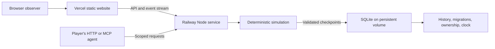

# Browser world architecture

Praxans has one authoritative world process. Browsers observe it; external agents send bounded requests. Neither a browser's frame rate nor a model response controls simulation time.

## Source boundaries

| Location | Responsibility |
| --- | --- |
| `src/simulation/types.ts` | Explicit saved state, snapshots, tick units, format version |
| `world.ts`, `terrain.ts`, `surface.ts` | Initial conditions, seeded planet, region materialization, frontier founding |
| `planet.ts`, `chronology.ts` | Orbits, solar position, moon, calendar, geological epoch |
| `chemistry.ts`, `laws.ts`, `thermodynamics.ts` | Element identities, material balances, biochemical energy, statics, selected entropy flows |
| `climate.ts`, `weather.ts`, `geology.ts`, `ecology.ts`, `fauna.ts` | Planetary heat exchange, local environment, dormant propagules and living processes |
| `landscape.ts`, `weathering.ts` | Sediment/surface evolution, fabric loss, repair, salvage and storage exposure |
| `cognition.ts`, `society.ts`, `diplomacy.ts`, `progress.ts` | Personal learning, local assemblies, journeys/commitments and civilization outcome feedback |
| `citizens.ts`, `economy.ts`, `engine.ts`, `actions.ts` | Needs, learning, work, relationships, ordered updates, bounded agent intervention |
| `physiology.ts`, `subsistence.ts`, `movement.ts`, `settlement.ts`, `geometry.ts` | Funded thermal needs, remembered supplies, spherical walking, connected camp area and material enclosures |
| `bodywork.ts` | Local body-maintenance opportunities, performed repair work, shared fiber transfers and thermal feedback |
| `src/server/app.ts`, `schema.ts` | HTTP/MCP, scoped authorization, action validation, public snapshots and event streams |
| `observer.ts`, `atlas.ts` | Public projections and progressively sampled planetary imagery, separate from authoritative state |
| `store.ts`, `backup.ts`, `archives.ts`, `migrations.ts` | Atomic SQLite storage, bounded native backups, verified migration archives, ownership lease, recovery clock |
| `src/server/intervention.ts`, `src/simulation/renewal.ts` | Private, finite, idempotent operator renewal with explicit boundary inventories and permanent history |
| `gateway.ts`, `runtime.ts`, `worker.ts`, `artifact.ts`, `preflight.ts` | Stable HTTP/SSE transport, replaceable sole-writer runtime, verified artifacts, private candidate validation and durable activation |
| `src/client/` | Planet entrance, landscape rendering, inspection, history, and agent onboarding |

The historical Python modules and authored content definitions do not participate in the browser runtime.

## Clock ownership and determinism

The world stores a nonnegative integer tick and the seeded PRNG state. One tick represents 900 simulated seconds. The host aims to advance one tick every 250 real milliseconds: one simulated day takes 24 real seconds at full speed. Weather and ecology update hourly; geological changes integrate daily at their much slower physical rates.

A persisted wall-clock checkpoint records how much real time has been processed. After interruption, the server advances every missed tick in bounded batches. It does not jump over hunger, metabolism, births, weather, or other consequences. The public health response reports lag, recovery state and proposal availability. Advisory proposals enter at the current logical tick even during recovery; they cannot change earlier ticks, skip debt or execute work immediately. New founding waits when recovery is more than ten real seconds behind. Very large backlogs and growing worlds can take time to recover.

Recovery yields between work batches and promptly schedules further overdue ticks. It does not add an ordinary tick delay to every recovery batch. Observer broadcasts have a wall-time ceiling so accelerated recovery need not transmit every intermediate frame; simulation time and the persistent checkpoint retain all processed steps.

A database lease prevents two processes from advancing the same saved world. The owner renews it every five seconds; an interrupted owner's lease expires after thirty seconds. Save and clock checkpoint commit together. A graceful stop saves and releases ownership. A fault preserves the last valid checkpoint and makes health fail. A busy pre-write checkpoint is recoverable: the server retains that computed state, defers further simulation steps, keeps observation available and retries before advancing. It reports `waiting-for-storage`; new advice receives `WORLD_STORAGE_BUSY`, while committed receipt replay remains available.

In production, the gateway retains public observer connections while a compiled runtime owns the database and clock. A hotfix first validates its migration and forward steps on a private consistent copy. The gateway then drains current requests, queues arrivals, checkpoints/stops the old owner, and starts the prepared candidate. Complete compressed SSE records continue over the existing browser connection. A durable activation pointer survives gateway restarts; incompatible or missing referenced artifacts fail closed. An actual container/host replacement still interrupts this single-host transport.

Deterministic replay means the same state, tick sequence, PRNG, laws, and ordered actions produce the same result. Network arrival times and different agent choices are external inputs, not deterministic predictions.

Storage encoding has its own SQLite `user_version`, independent of the world's format and physical law version. Version 1 retains existing plaintext migration archives and writes new archives as independently compressed 256 KiB blocks with per-block and full-original SHA-256 checksums. Serialization follows ordinary world JSON order, using additional string memory proportional to the largest record. It does not serialize a second complete world string. Before a further law migration, older plaintext archives are losslessly encoded in the same block format: original byte sequences, checksums, identities and dates remain authoritative. One old row is read before loading terrain; stored blocks are fully verified before its replacement commits. Each conversion is separate from the later law transaction and remains readable by the preceding storage-version-1 runtime if that later migration fails. SQLite reuses freed pages; this does not shrink the database file or remove history.

The archive, physical migration, checkpoint and intervention records commit in one transaction. Loading owns its parsed world exclusively and may transform that object after archiving it; the public migration function remains pure by default. Failed migration discards that owned object and rolls back its rows. The additive storage-schema upgrade commits separately before loading, so it can remain after a later physical migration fails. Preflight now exercises the real archive transaction on its private copy. A current-format preflight creates no new physical archive. Full historical verification belongs on an offline backup: old plaintext archives still require their original large row to be read.

## An immense, finite frontier

The planet uses an equal-area surface projection with longitude wrapping and polar boundaries. A cell covers 100 m²; a region contains 32 × 32 cells. The Earth-sized surface has roughly five trillion possible cells. The first observer window spans 96 × 96 cells.

Continental elevation and climate priors come from seeded spherical fields. The globe atlas samples the same fields. Regions are generated deterministically when a new settlement or actual travel needs them; moving the camera does not create land. New settlements search the frontier away from developed communities and require a habitable, adequately supplied local site.

Materialized regions remain in the world and continue running when unobserved. Unmaterialized regions have seeded priors, not a fully simulated past. Their matter and arriving founders enter an explicit boundary inventory when they join the simulated volume. The conservation ledger includes those additions. Existing regions are not regenerated on a code update, and each world retains its generation version.

The current engine runs all active regions in one Node process. A vast address space does not imply unlimited CPU, memory, observers, or simultaneous civilizations. A future hierarchy of regional simulation and transport must preserve material fluxes and time before it can replace this foundation.

## Learning and agents

People choose work from bodily drives, policy, locally remembered opportunities, attention and experience. A bounded adaptive network changes activity preferences after real outcomes. Sleep consolidates personal knowledge; teaching needs a nearby holder. Experiments spend actual samples and record predictions, failures and uncertainty. Construction supplies stronger evidence. Useful ideas guide material gathering; scarcity changes practicality without an arbitrary gathering cap making every costly idea unreachable. No named template grants a physical affordance.

Conditional task selection retains the urgent-need gates and one initial work-lottery draw, rescaling its selected or rejected interval for later eligible branches. Failed assignments can continue; infeasible preferred designs can yield to remembered alternatives through the same construction validator. This is an explicit behavioral policy with finite numerical precision. It changes future task frequencies without resetting RNG or rewriting prior work.

Body maintenance extends the existing repair activity. A transient index captures people and their occupied cells at the start of each tick; the first observer of a cell estimates local covering opportunities for that quarter-hour. Decisions and performed transfers recheck contact and supplies. Existing active tasks earn finite capacity after ordinary fatigue and bodily costs. After every person's movement and physiology, a common boundary allocates available fiber proportionally and commits actual placement/removal before deaths and journeys. Removed fiber cannot fund another placement at that same boundary. The citizen scheduler first updates everyone’s physiology, then commits optional ration pickup, then performs decisions/movement/work and the existing body transfers. Current meals, cold fuel and ice melting therefore use accessible food before anyone refills reserves. Refill requests snapshot camp access and share one finite residual stock budget proportionally, with duplicate and stale-contact checks. The inherited 3 kg target and proportional contention are explicit controller conventions, not social agreements. Private rations, work cargo and caravan stores retain their custody. Competition between current physiological withdrawals remains sequential; staging those requests requires an integrated funded metabolic model.

Task fields retain a recipient, target covering mass and kilograms actually moved. The index, opportunity estimates and transfer claims are not saved. Signed marginal thermal outcomes feed the existing repair-learning path; observed opposing self-adjustment prompts another choice. This represents neither spoken consent nor knowledge of a peer's private intentions. Shared heat/shelter calculations belong in physiology, not a second protective-bonus system.

An external agent receives an observation and submits one to six typed proposals. A transaction validates and queues the whole batch atomically with its receipt. A receipt confirms submission, not acceptance. Local adults deliberate; quorum, consent, bodily needs, trust and feasibility constrain later execution. All keys share a community's six-pending-proposal capacity and four-simulated-hour interval. Retrying the same request ID and body returns the prior receipt within its retained window. Votes, decisions and subsequent observational reviews persist.

Submission staging copies only the affected community, event queues and root bookkeeping. Unchanged physical state is shared read-only until the synchronous commit replaces the authoritative root; failed validation or database commit cannot leak a proposal. Independent simulation callers retain a fully isolated result through the separate `applyAgentActions` wrapper. This reduces submission allocations but does not make full-world checkpointing incremental.

Contacts are per-community, dated reports. New correspondence travels with living volunteers who eat, rest and leave work behind. Trade reserves only the sender's cargo; a recipient can decline on arrival. Return cargo needs the homeward leg. Free-form letters are inert data; supported commitment primitives need reciprocal assent and actual fulfillment. Existing pre-format-8 escrowed exchanges retain their original terms. Outcome feedback is a vector of state potentials sampled once per world day; reads do not create rewards.

Agent execution happens outside the world process. The server stores a hash of each civilization key and exposes no arbitrary code execution endpoint. Model outages do not block autonomous local behavior.

## Persistence and observation

SQLite uses WAL mode with full synchronization. Metadata and each materialized region carry checksums. Durable tables retain events, historical measurements, sessions, scoped agent records, action receipts, releases, and migration snapshots. The in-memory event ring is only a recent working view; the browser can page through the permanent journal.

The entrance polls a small overview every five seconds and shares a one-second server summary cache. It displays a 256×128 planet atlas before requesting 1024×512 refinement. Detailed SSE starts only after entering the surface and closes on returning to the entrance. A shared async atlas task yields between row batches; it still runs on the simulation process's event loop.

Detailed viewers receive a snapshot and periodic compressed frames. Public people omit synapses, activations and pending learning; place memories expose coordinates rather than full resource maps. Dormant cohorts omit full inherited genomes. Authoritative state and the scoped agent's fuller people observations are preserved. Public values are rounded for transport; physical calculations retain their precision. A slow observer can be disconnected rather than indefinitely buffering updates. The current service limits concurrent streams to 100.

SQLite caps retained reusable WAL space at 16 MiB when the log is reset after checkpointing. Active transactions or held readers can require a larger WAL; this is not a hard disk-use cap. Transactions first restart the checkpointed log so a reader that delayed an earlier automatic checkpoint cannot leave two full write batches to accumulate. Backups copy through SQLite in short asynchronous page batches; completed copies are published exclusively. A long reader can delay a transaction, and one large save still needs its own full WAL headroom. Backups must fit outside the live data volume or include demonstrated database/WAL headroom. The [scaling review](research/scaling-and-open-endedness.md) records remaining global scans, unbounded entity-frame growth, monolithic metadata writes and coarse/fine execution requirements.

The local map uses Canvas, visible-tile traversal, object culling and bounded raster/frame scheduling; the globe lazy-loads Three.js. A cancellable browser worker samples the world's pinned terrain generator for planetary exploration, with fewer than 100,000 samples and at most three retained rasters. This is a geography survey, not a parallel simulation. Visiting a community switches to its authoritative local snapshot. Camera movement neither materializes server regions nor invents fine physical reservoirs.

Geometry and colors come from world data. Pausing is local to an observer; hidden/explorer-covered local canvases stop drawing, and test time controls exist only in explicitly enabled development runs. The current surface resolution is 100 m²; fine construction geometry and future subsurface physics are separate scales.

See [hosting](hosting.md) for volume, backup, release, and migration procedures, and [model scope](model.md) for the scientific assumptions.
