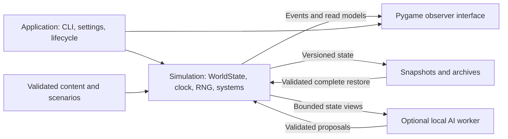
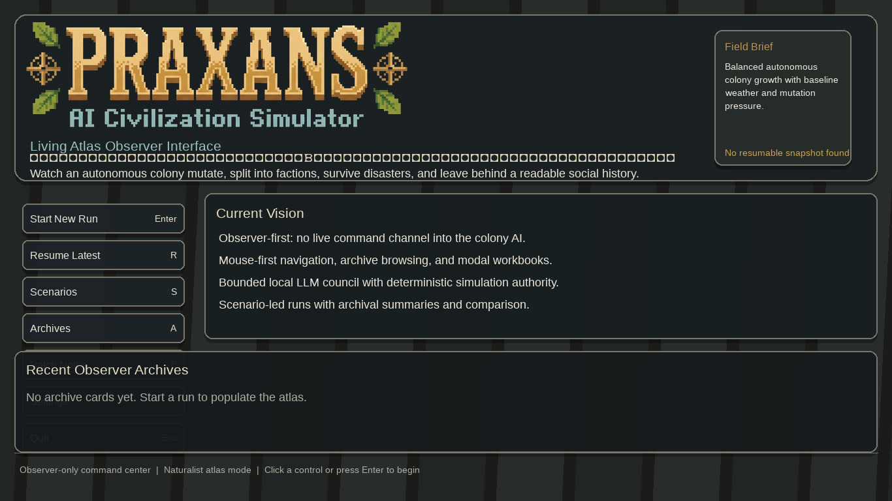
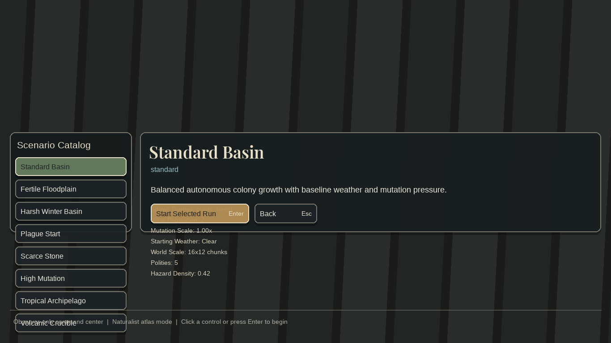
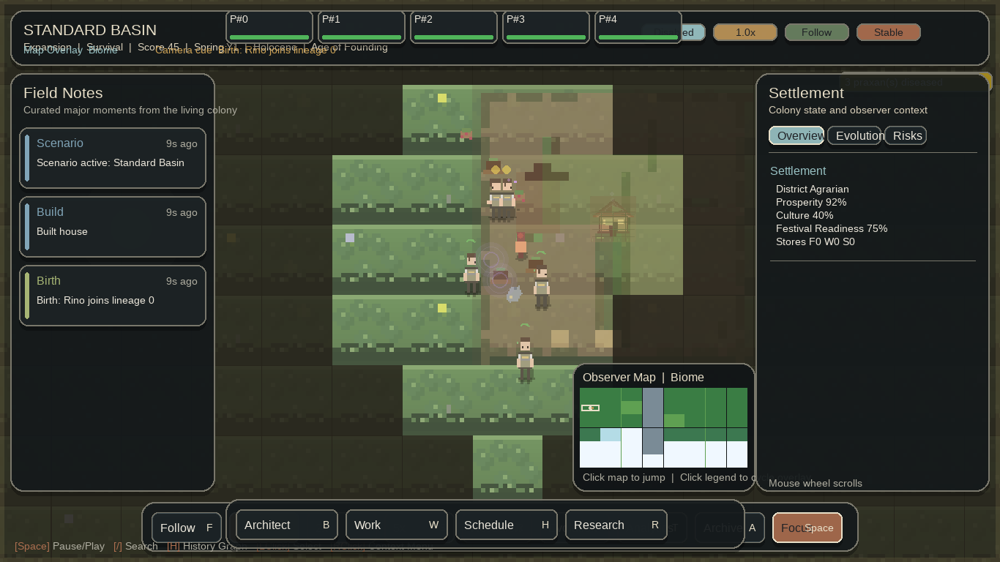

# Praxans: assessment and rebuild proposal

> Historical assessment: the user subsequently chose a complete shared-world browser rebuild. Its Python-first proposal is superseded by ADR-017; the reproduced findings below remain unchanged. See the [current README](../../README.md).

Assessed 2026-10-07. Scope: inspect the existing project, run it locally, and propose a rebuild. Implementation remains proposed.

Praxans has enough working code and authored content to justify a staged rebuild of its foundation. Preserve the autonomous civilization concept, content definitions, and useful subsystems. Establish reliable saves, observable system execution, and a consistent simulation clock before expanding the game. Continue with Python and Pygame for the first milestone; reconsider the engine only if measured requirements demand it.

The existing game launches and its unit tests pass, but live checks exposed broken restoration and inactive systems that the test suite and batch runner report as healthy. It is a runnable development prototype with substantial integration work remaining.

## Repository reality

| Branch | Revision | Actual contents |
| --- | --- | --- |
| `main` — GitHub default | `89df2f81ebcd5144bce7f32f5f1e7251fab0f2e6`, 2026-05-07 | Six documentation/metadata files, including the MIT license and canonical `.molthub/project.md`. README says runtime code does not exist. |
| `master` | `b65f5b695b3e298484c1195cc36ac340e6d290fd`, 2026-04-06 | The game, assets, systems, launchers, and tests. It lacks the license and metadata files present on `main`. |

These branches have **no common ancestor**. A normal update of the current default checkout will not recover the game. A future integration branch should start from `main`, explicitly merge the unrelated `master` history, and resolve the documentation around the actual runtime. Preserve both histories and the canonical metadata. No branch merge, push, or GitHub setting change was made during this assessment.

The original Windows checkout remains at `/mnt/c/Users/jorqu/projects/Praxans` on `main`. Assessment work is in a separate worktree at `/home/jorqu/Praxans`, branch `codex/praxans-foundation`, based on `origin/master`.

The runtime branch contains 675 tracked files, 147 Python files, and 66,594 Python lines including tests. There are 49 test modules and 403 distinct content definitions across 31 definition types. All core JSON files parsed, with no duplicate type/ID pairs; this is not a full content-reference validation.

## Verified baseline

Environment: WSL Linux, Python 3.12.3, Pygame 2.6.1, pytest 9.1.1. Runtime checks used SDL's dummy video/audio drivers and disabled local-model inference.

| Check | Result | What it establishes |
| --- | --- | --- |
| Documented dependency installation | Failed | `noise==1.2.2` builds a native extension and this WSL environment lacks `Python.h`. The supposedly optional dependency is mandatory in `requirements.txt`. |
| Installation without `noise` | Succeeded | The documented math-noise fallback can run the game. Pygame, the Ollama package, and pytest were installed in the project venv. |
| Syntax compilation | 147/147 Python files passed | Source parses under Python 3.12.3. |
| Documented unittest command | 1,140 tests passed | Existing unittest suite passes. |
| Pytest over `tests/` | 1,143 tests and 3 subtests passed | Includes three additional function-based exception-hygiene checks. |
| Four fresh scenarios | All reached 900 frames | Standard, harsh winter, plague, and high mutation launched, simulated, rendered, and wrote artifacts. |
| Four continuations from those saves | **All four logged restore failures** | Processes continued with partially restored state; these are failed continuity checks. |
| Live subsystem probe, five frames | Governance: 0 calls; migration: 0 calls | Mentorship, feuds, and chronicle each received five update calls. |
| UI captures | Home/scenarios at 1920×1080 and 1366×768; live game at 1366×768 | Rendering works, with visible layout collisions. |
| Isolated frame pacing | 15.09 FPS measured with a 30 FPS setting | Matches the two frame limiters in the main loop. |

The existing batch report labels **8/8 runs successful and zero crashes**. Inspecting its stdout/stderr revealed the four restore failures. Its success count should not be used as a release gate in its current form.

### Scenario observations

All runs used seed 11, the shipped `legacy_data.json`, disabled LLM behavior, and the fallback noise implementation. Fresh runs were executed two at a time. Population differences include the existing legacy bonuses and simulation events.

| Scenario | Fresh frames | Fresh wall time | Final population / buildings | Resume frames | Audited resume result |
| --- | ---: | ---: | ---: | ---: | --- |
| Standard | 900 | 87.10 s | 5 / 3 | 150 | `NameError: name 'now' is not defined` |
| Harsh winter | 900 | 84.41 s | 7 / 4 | 150 | Same failure |
| Plague | 900 | 102.23 s | 7 / 3 | 150 | Same failure |
| High mutation | 900 | 102.83 s | 9 / 4 | 150 | Same failure |

These are short integration checks. They do not establish long-term colony balance, multi-generation stability, or large-population performance. Batch frame rates include concurrent workloads and assessment instrumentation; the separate solo run is the useful frame-pacing measurement.

## Findings in priority order

### F1 — High: save restoration leaves a partially restored simulation

At [praxans_game.py:5694][restore-source], the resume path calls `aspiration_manager.restore(aspirations_data, now=now)`, but `now` is not defined in `main()`. Other restorers below it use the same missing variable. The exception handler prints the failure and continues after earlier restoration has already mutated the world. Later systems, camera restoration, and cleanup of queued initial resources are skipped.

This reproduced in all four continuation runs. The processes still exited zero and reported no crashes. The batch checker checks artifacts, selected error strings, and crash counts; it does not establish successful restoration or state continuity ([simulation_lab.py:253][lab-source]).

Required result: construct and validate a complete restored session before activating it. Fail clearly when loading fails. Preserve existing saves and support a versioned migration path. Add a process-level save→resume check that compares real entity IDs, resources, system state, and the simulation clock before advancing again.

### F2 — High: governance and migration do not run

The live update blocks at [praxans_game.py:6616][governance-source] and [6633][migration-source] refer to `local_names`, which is only assigned in the shutdown block at line 8034. Both updates therefore raise `UnboundLocalError` before reaching their managers. `except Exception: pass` hides the errors.

A five-frame probe counted zero governance/migration update calls and five calls each to mentorship, feuds, and chronicle. Tracing enabled after the first tick captured four occurrences at each failing line. This demonstrates a gap between isolated manager tests and actual game integration.

Required result: pass explicit dependencies into the system runner and make every enabled system's execution and failures observable. Verify that real events can produce edicts and faction movement in the running simulation.

### F3 — High: simulation time has several incompatible owners

The loop calls `clock.tick(FPS)` at [line 6035][clock-start] and again at [line 7994][clock-end]. It then overwrites the measured delta with `1.0 / FPS` at [line 6275][delta-source]. Entity age, reproduction, crafting, and other cooldowns use `time.time()`. The tick manager separately accumulates logical time and uses sets for entity iteration.

In the solo 1366×768 run, 30 configured FPS produced 15.09 observed FPS. More fundamentally, changing speed or frame rate cannot consistently accelerate systems that use wall-clock timers. A seed alone does not provide deterministic replay: snapshots do not store the simulation RNG state or a complete scheduler state.

Required result: one simulation clock, fixed logical steps, stable system/entity ordering, an owned RNG, and separate rendering cadence. Pause must freeze all simulation timers. Running the same seed for the same number of simulation ticks should produce the same state regardless of rendering speed.

### F4 — High: the entry point still owns most of the application

`praxans_game.py` is 8,207 lines; its `main()` is 3,219 lines and its restore helper is 676. `entities/praxan.py` is 3,603 lines and `systems/advisor.py` is 2,224. Four modules import `*` from the entry point: the creature, advisor, spatial systems, and legacy UI panels.

Importing the entry point parses process arguments and initializes Pygame. Several tests must temporarily rewrite `sys.argv` before importing it. Simulation, display setup, persistence, UI routing, and subsystem wiring are interdependent.

Required result: an importable simulation package with explicit state and interfaces. Move ownership of state and time first, then migrate systems in small groups. Existing rendering frame models and event interfaces provide useful starting boundaries.

### F5 — Medium: laptop layouts hide controls and mix multiple interface layers

At 1366×768, the recent-archives panel covers the lower home menu. The scenario list crosses the footer, and the start button overlaps scenario details. In the live game, the pawn roster overlaps the header and the bottom control bars overlap. The layout allocates fixed sections without ensuring their contents fit ([ui/layout.py:64][layout-source]).

The product promise also needs enforcement. Documentation specifies observer-only play, but `_handle_ui_action` directly changes creature work priorities and schedules ([praxans_game.py:5925][control-source]). Treat this as a product inconsistency to resolve deliberately.

Required result: a clear observer interface with a readable world, event timeline, creature/settlement inspector, and playback controls. Validate fitting and interaction at 1366×768 and 1920×1080. Keep developer intervention in an explicitly separate tool. Use player-facing language to explain the colony and its decisions.

### F6 — Medium: local AI world generation is disconnected

The "Dream Local World" handler imports a nonexistent `get_global_ollama_client` at [ui/planet_select.py:96][world-ai-source]. Invoking the handler reproduced an import error and returned a normal landing with `ai_world_seed: null`, without making an inference call.

There are additional wiring issues: the handler performs generation synchronously from the UI loop, and `main()` copies the returned planet tile but does not carry its `ai_world_seed` into world construction.

Required result: hide or clearly disable unavailable capabilities until complete. If retained, route generation through the existing asynchronous service, honor LLM opt-out, validate the response, and apply the result explicitly. The base simulation must remain usable offline.

### F7 — Medium: setup and generated state need a reproducible boundary

There is no package manifest, dependency lock, or GitHub Actions workflow in the runtime tree. README setup is primarily Windows-oriented and the broad Python 3.8+ promise has no visible compatibility matrix. The documented requirement set failed here on a native dependency that the runtime can operate without.

The repository also tracks `legacy_data.json` containing previous progression and unlocks, as well as scratch scripts and historical test output. A fresh clone therefore inherits prior progression. Save files are written directly to their destination, without an atomic replacement step ([run_snapshot.py:702][save-source]).

Required result: tested Python support, a minimal base install with optional extras, packaged content paths, isolated user data, atomic saves, and Windows/Linux CI. Historical artifacts should be clearly archived or removed from the active development surface after review.

## What is worth retaining

| Existing investment | How to use it in the rebuild |
| --- | --- |
| Autonomous colony, lineages, social history | Keep as the product identity: understand a civilization through its inhabitants and events. |
| JSON definitions and scenario profiles | Retain content; add schemas and cross-reference validation. |
| Event bus, chronicle, episodic memory | Preserve concepts and useful implementation; use simulation timestamps and explicit event contracts. |
| Graphics package and render-frame models | Adapt to read-only simulation views; retain the asset pack as the initial art baseline. |
| Ecology, disease, society, diplomacy, research | Migrate in dependency order once the core loop and lifecycle are reliable. |
| Existing unit tests | Keep useful behavioral assertions and add tests that cross actual runtime boundaries. |
| Snapshot/archive structures | Preserve player continuity through explicit converters and representative legacy fixtures. |
| Async LLM scheduler and response contracts | Keep behind an optional adapter with bounded work and deterministic validation. |

## Proposed product and architecture

The first rebuilt experience should let someone start a small colony, follow a named creature, understand why it acts, witness a consequential event, and resume the same civilization later. The observer should be able to answer: **what happened, who was affected, and why?**

Recommended initial target: a dependable local desktop simulation with a small population and strong visibility into individual lives. A browser port, multiplayer, cloud inference, and a larger simulation scale would each introduce additional requirements; none is needed to prove this first milestone.



A simple package split is sufficient initially:

```text
src/praxans/
  __main__.py          # CLI entry point with no import-time launch
  app/                 # configuration, lifecycle, playback controls
  simulation/          # world state, clock, RNG, entities, ordered systems
  content/             # definitions, scenario loading, validation
  persistence/         # schemas, migrations, atomic save/restore
  presentation/        # Pygame rendering and observer UI
  ai/                  # optional Ollama adapter and proposal validation
tests/
  unit/
  integration/
  scenarios/
```

Use plain state objects and explicit interfaces first. The simulation package should run without importing Pygame or contacting a model. Avoid introducing an ECS or replacing the renderer until profiling demonstrates a need. Proposed decision: [ADR-016](../../devlog/DECISIONS.md#adr-016-staged-rebuild-around-an-explicit-simulation-core).

## Delivery sequence and acceptance gates

| Stage | Deliverable | Gate before proceeding |
| --- | --- | --- |
| 0. Recover one source of truth | Integrate the two Git histories; accurate README, license, agent guidance, metadata, and setup | A fresh clone of the canonical branch can install, launch offline, and run its documented checks. |
| 1. Establish a trustworthy baseline | Repair restoration and inactive system wiring; expose failures; remove the duplicate frame limiter; separate generated progression | Real save→resume checks pass; enabled systems execute; failed restore or fatal startup returns failure; the checker rejects broken runs. |
| 2. Build the simulation core | Own world state, clock, RNG, lifecycle, and ordered update schedule; migrate needs, gathering, building, birth, and death | Same seed + tick count gives the same state across display rates and playback speeds; pause freezes timers; core imports without SDL. |
| 3. Complete one observer experience | Rework home→scenario→run→inspect→save→resume flow; one coherent responsive UI | All essential controls fit and work at both tested resolutions; users can identify a creature's goal and the cause of a colony event. |
| 4. Restore simulation depth | Port ecology/disease, then society/research/diplomacy, then advanced culture/legends systems | Each group passes real-event integration and save-continuity checks before being enabled by default. |
| 5. Complete optional local AI | Connect advisor/narrative/world generation through validated asynchronous adapters | No model is required for core play; slow/unavailable/malformed responses leave the UI responsive and simulation state valid. |
| 6. Prepare a distributable prototype | Windows/Linux checks, reproducible packaging, content validation, compatible saves, profiling | Clean-machine launch and a documented endurance run succeed; supported population and hardware targets are backed by measurements. |

The stages depend on each other, but visual design exploration can accompany stage 2. The runtime remains available as the reference implementation while systems migrate. Retain old saves and scenario fixtures throughout; do not overwrite them during conversion.

### Concrete first implementation changes

1. **Repository and setup integration:** create a branch from `main`, merge `master` with explicit unrelated-history handling, resolve the README, retain the MIT license and canonical metadata, declare the tested runtime, and document the optional dependency path.
2. **Live reliability repairs:** fix the undefined restore timestamp and `local_names` references, make restore activation all-or-nothing, record system failures, propagate fatal outcomes, and improve the batch checker. Add real-world regression coverage for these exact failures.
3. **Time ownership:** remove the second frame limiter, introduce a simulation clock and owned RNG, and migrate age/cooldown/resource timers together. Establish replay and speed-invariance checks before retuning gameplay.

A full core migration and UI rebuild follow those changes. Their scope can then be estimated against a baseline whose checks expose actual failures.

## Visual evidence

Captured from the existing renderer using the SDL dummy driver, with the existing assets and fonts available in this WSL environment. These are baseline screenshots, not proposed designs. Native Windows font/rendering behavior still needs checking.

Home at 1366×768: the archive surface covers lower navigation controls.



Scenario browser: controls and metadata exceed their allocated sections.



Live simulation: the world renders, while header and transport controls collide.



## Commands, artifacts, and limitations

The initial `python3 -m venv .venv` also encountered missing `ensurepip` in WSL. Pip was bootstrapped inside this new worktree's venv using the Python Packaging Authority bootstrap script. System packages and Codex permissions/configuration were not changed.

After the documented requirements installation failed, the working assessment install was:

```bash
.venv/bin/python -m pip install 'pygame>=2.6,<3.0' 'ollama>=0.6,<1.0' pytest
```

The Ollama client package was installed for import compatibility; inference was disabled for runtime checks. Commands run from the worktree included:

```bash
export SDL_VIDEODRIVER=dummy
export SDL_AUDIODRIVER=dummy
export PYGAME_HIDE_SUPPORT_PROMPT=1

.venv/bin/python -m unittest discover -s tests
.venv/bin/python -m pytest -q tests \
  --junitxml=logs/assessment-2026-10-07/pytest.xml

.venv/bin/python scripts/simulation_lab.py \
  --headless-scenarios standard harsh_winter_basin plague_start high_mutation \
  --headless-seeds 11 --headless-max-frames 900 \
  --resume-runs 1 --resume-max-frames 150 --visual-checks 0 \
  --parallelism 2 --telemetry-interval 5 \
  --output-root logs/assessment-2026-10-07

.venv/bin/python praxans_game.py --headless --disable-llm \
  --max-frames 150 --seed 11 --width 1366 --height 768 \
  --telemetry-interval 1 --log-dir logs/assessment-2026-10-07/visual-run
```

The visual run used an in-memory display-flip hook to save its surface. Additional assessment-only probes counted manager calls, traced main-loop exceptions after startup, invoked the broken world-generation handler, and captured the menu through scripted Pygame events. They did not edit runtime source. An initial broad startup trace was stopped because of tracing overhead; the narrower live probe supplied the recorded result.

Portable findings and measurements are in [evidence.json](evidence.json). Raw local outputs remain under `logs/assessment-2026-10-07/`, notably:

- `unittest.log`, `pytest.log`, and `pytest.xml`;
- `simlab_20261007_153936/`, containing all eight process logs, telemetry, snapshots, and the original batch summary;
- `live-probe/trace-result.json`, containing manager call counts and exception locations;
- `visuals/` and `visual-run/`, containing full UI captures and the solo run.

No native Windows interactive playtest, live model inference, native-noise backend check, complete planet-landing input flow, long-term balance study, or high-population endurance run was performed. These remain explicit validation work for implementation. The reported passing unit tests are not evidence that those checks have passed.

Changes made for this assessment are this report, its JSON evidence and three images, and documentation entries in the devlog. Runtime source and the original checkout were left unchanged. No new tests were added for documentation changes.

### Suggested MoltHub Workbench memory for owner review

> The executable Praxans baseline is on `master`; GitHub's `main` contains documentation and canonical metadata on an unrelated history. Assessment found live save/restore and system-wiring failures despite passing tests. A staged rebuild preserving the autonomous local simulation is proposed. Product direction and implementation remain to be decided after review.

This suggestion is recorded here only. No MoltHub Project Memory or external application was updated. Keep the eventual public `.molthub/project.md` aligned with durable project status after repository integration.

[restore-source]: https://github.com/Perseusxrltd/Praxans/blob/b65f5b695b3e298484c1195cc36ac340e6d290fd/praxans_game.py#L5694
[lab-source]: https://github.com/Perseusxrltd/Praxans/blob/b65f5b695b3e298484c1195cc36ac340e6d290fd/scripts/simulation_lab.py#L253
[governance-source]: https://github.com/Perseusxrltd/Praxans/blob/b65f5b695b3e298484c1195cc36ac340e6d290fd/praxans_game.py#L6616
[migration-source]: https://github.com/Perseusxrltd/Praxans/blob/b65f5b695b3e298484c1195cc36ac340e6d290fd/praxans_game.py#L6633
[clock-start]: https://github.com/Perseusxrltd/Praxans/blob/b65f5b695b3e298484c1195cc36ac340e6d290fd/praxans_game.py#L6035
[clock-end]: https://github.com/Perseusxrltd/Praxans/blob/b65f5b695b3e298484c1195cc36ac340e6d290fd/praxans_game.py#L7994
[delta-source]: https://github.com/Perseusxrltd/Praxans/blob/b65f5b695b3e298484c1195cc36ac340e6d290fd/praxans_game.py#L6275
[layout-source]: https://github.com/Perseusxrltd/Praxans/blob/b65f5b695b3e298484c1195cc36ac340e6d290fd/ui/layout.py#L64
[control-source]: https://github.com/Perseusxrltd/Praxans/blob/b65f5b695b3e298484c1195cc36ac340e6d290fd/praxans_game.py#L5925
[world-ai-source]: https://github.com/Perseusxrltd/Praxans/blob/b65f5b695b3e298484c1195cc36ac340e6d290fd/ui/planet_select.py#L96
[save-source]: https://github.com/Perseusxrltd/Praxans/blob/b65f5b695b3e298484c1195cc36ac340e6d290fd/run_snapshot.py#L702
