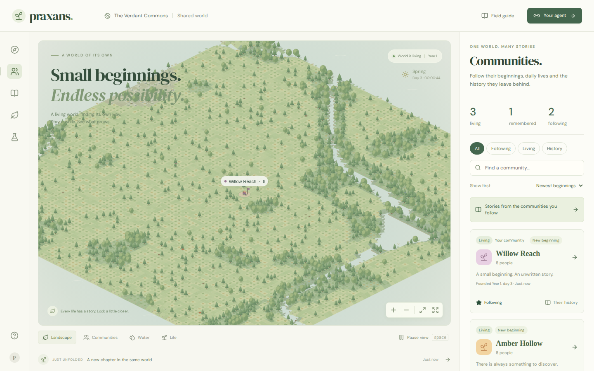

# Community records and following — 2026-10-08

Release identity: **community-records-20261008**. State format **8**, natural-law version **biosphere-1.2**, existing planet and generation unchanged.

The browser adds community search, living/history views, dated new beginnings, personal following and focused journals. Historical communities retain their record, material remains and explicit connections to later beginnings. An ending date requires matching archived individual deaths to the saved death counter; missing history stays unknown. Future branches record their actual origin using the existing event field.

Following is stored in the observer's browser for up to 64 groups. Accounts, notifications, inheritance and reoccupation of ruins remain future work. The [community contract](../communities.md) describes the exact behavior and limits.

[View a community’s retained history](../images/community-history.png).

## Validation

Both independent GitHub runs pass for implementation commit **2ff6c1e**: **87 model/server tests**, 40 general browser checks, 22 community/extinction checks, 12 compiled-production checks and 17 runtime-hotfix checks. Thirteen targeted model/server tests also passed locally. Build and formatting pass. Current desktop/mobile screenshots and the supplied game interaction loop were inspected; browser error lists are empty. The physical model is unchanged and its earlier recovery/seasonal evidence remains in the [recovery release](world-recovery-0.2.md).

## Continuing-world release

A consistent backup was created at tick **78836**, with the same four historical communities, 12 browser sessions, one agent and three receipts. It contains 2,028 permanent events and the original pre-migration archive. File size is **98,598,912 bytes**, SHA-256 **d45a9a6eac0178ed4b1a2d27cca1406e5bb97cb7192765f0d19b101f2d5bdf2f**. Metadata and all 38 region checksums pass; SQLite integrity is valid.

The independent compressed and extracted backup copies match the server, including every region and the ownership/archive signatures. The compressed representation is **30,120,336 bytes**, SHA-256 **f58fdc575806710e7ce248801cd7059878d96f97f636829edaf1af17b0c6e9f1**. Only the redundant raw backup representation on the service volume was removed after verification. The local full copy and both compressed copies remain.

The compatible runtime was activated **in the existing container**, with the same gateway process and persistent volume. The sole simulation worker changed from process 20 to 159. The immutable runtime SHA-256 is **3267c57d12e6aad3ba3da9517cf8dc6749ece9d83ce10bfd88f345ddbb4d09a4**. The durable active pointer selects `community-records-20261008-3267c57d12e6aad3`; no pending pointer remains. The release is recorded once at tick **82900**, with identical before/after state checksums. Retrying the operator request reports the artifact already active.

At tick **87380**, all metadata and 38 region checksums pass. The same four communities, 12 pre-release sessions, agent, three receipts, 2,028 pre-release events and original pre-migration archive match exactly. Clock advancement from the backup is exactly **2,136,000 ms = 8,544 ticks × 250 ms**. The world is healthy with about 38,761 seconds of catch-up remaining; new founding/advice still waits for that debt. There are no living people or animals. Growing plant tissue has reached approximately **3,213 kg**, with 303 plant cohorts and 1,045 dormant cohorts. These are observations, not a guarantee of long-term equilibrium.

All four public community records and their scoped journals were checked against the retained death counters. Vercel production deployment **dpl_Bvs29UugvLY47yFvnNRm8Xjj2Noy** is **READY**, aliased to **https://praxans.vercel.app**. Its immutable URL is `praxans-fbnxkg7yb-perseusxr-projects.vercel.app`. Browser flows and screenshots were verified locally; publication was verified from provider metadata. An already open page loads the new controls after refresh.

The [machine-readable evidence](../validation/community-records-continuity.json) includes the backup, live continuity, public records and independent CI results.

## Observer transport limitation

One external compressed SSE probe received its initial snapshot and 31 frames, then disconnected during the live handover. Its last observed tick was 82892. The operator SSH command also failed to deliver its final reply, although the new runtime was already active. Subsequent status, the durable pointer, the single release event and direct history/health reads confirmed successful activation. The gateway stayed running and no out-of-memory event was recorded.

A separate test on a disposable copy of the actual 38-region backup retained its compressed connection through the same runtime replacement, receiving both approximately 8.6 MB and 8.5 MB snapshots with monotonic ticks and no error. This rules out treating the larger snapshot alone as a demonstrated failure, but it does not identify the external disconnect's cause. Uninterrupted live transport remains an open verification item; the state-preserving runtime update and community website publication are verified.

A fresh public compressed connection then remained healthy for a two-minute probe: **72 frames**, tick **88652 → 89704**, no error. This confirms ongoing observation after publication; it does not retroactively establish an uninterrupted handover.
