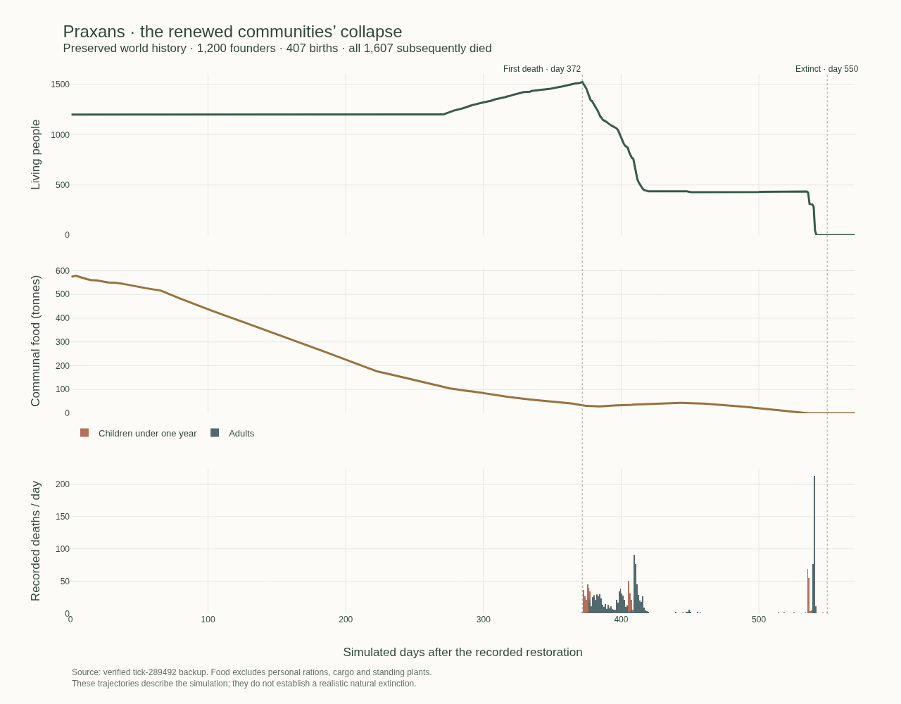

# Why the renewed communities died

Recorded 2026-10-08. **Confirmed system defects contributed to the collapse; this is not a validated natural extinction.** Saved history shows dwindling communal food and deaths in cold conditions. An exact historical replay proves that the first infant died from the model's cold-exposure health penalty, at home with usable fiber still in stock but no caregiver wrapping mechanism. Small controlled checks also reproduce food allocation by update order. The contribution of each defect to all 1,607 deaths remains unmeasured; correcting them does not establish that these habitats can sustain 300 founders and their descendants.

**Subsequent correction:** [performed body maintenance](../releases/body-maintenance-0.2.md) is now live. It adds a finite local work path for self/nearby protection and preserves every historical death. The findings below describe their recorded releases; food allocation, growth, metabolic energy and sustainable habitat capacity still need correction or validation.

The figure uses [daily history and death counts](collapse-timeline.json), not conditions observed after extinction.

**Evidence scope.** [Archive aggregates](collapse-forensics.json) come from the independently verified local backup at tick 289492, opened immutable/read-only, with its SHA-256 checked before and after querying public simulation events, history and metadata scalars. [The extractor](collapse-forensics.py) never loads or advances a world. [Mechanism results](collapse-mechanism-probe.json) use actual current functions on disposable synthetic fixtures, with source fingerprints; they are not a replay of the former live release. The [habitat analysis](collapse-habitat.json) reads three independent backups. The [historical replay](collapse-first-death-replay.json) uses the former engine in a detached checkout with a read-only observational wrapper. No preserved world was advanced or changed. Full backups, ownership records and credentials are excluded from this public study.

## What happened in saved history

The original 32 deaths predate this restoration. Their earlier overheating, ecological failure and subsequent numerical halt are documented in the [original recovery investigation](../validation/recovery-2026-10-08.md). The counts below concern the renewed population and keep those earlier deaths separate.

Renewal at tick 195860 added 1,200 adults. All 407 subsequent newborns and all 1,200 founders eventually died: 1,607 new deaths plus 32 retained historical deaths. One day is 96 ticks. The first new death was tick **231549**, day **371.76** after renewal; the last was **248627**, day **549.66**. The much later spring overview at tick 287132 describes conditions roughly 400 days after extinction, not the weather during the deaths.

| Community at death | New deaths | First death, days after renewal | Last death, days after renewal |
| ------------------ | ---------: | ------------------------------: | -----------------------------: |
| Fernhaven          |        381 |                          374.79 |                         450.51 |
| Amber Hollow       |        393 |                          371.76 |                         549.66 |
| Stonebrook         |        399 |                          405.40 |                         533.36 |
| Adonis             |        434 |                          535.49 |                         541.83 |

Community membership at death determines these counts. Adonis lost all 434 recorded inhabitants in a 6.34-day interval. Across the world, 444 deaths fell in days 360–390, 701 in days 390–420, and 440 in days 510–570; the smaller remaining intervals are retained in the JSON.

The first daily sample after renewal held **575.05 t of communal food**. The last daily sample before the first death held **33.57 t**, with 1,519 inhabitants and 28.84% forest. Peak sampled population was **1,525** at tick 231552, with 32.70 t communal food. The first daily zero-population sample, tick 248640, had zero communal food. These are **net stock levels**: they do not partition harvesting, meals, thermal fuel, packing, birth transfers or spoilage. Daily global stocks also do not establish which camp or person could reach food. Personal rations and cargo are excluded from this historical food field ([`stepWorld`](../../src/simulation/engine.ts)).

All 1,607 death events contain exact structured `lifeState`, including sickness and oxygen. This corrects the initial prose-only summary, which mistakenly treated sickness as unavailable. The table uses structured values, not rounded prose.

| Terminal measurement         |                   407 children |             1,200 adults |
| ---------------------------- | -----------------------------: | -----------------------: |
| Age                          | 2.04–264.23 days; median 85.31 | Floored ages 19–43 years |
| Nourishment exactly zero     |                              5 |           1,037 (86.42%) |
| Nourishment below 12         |                             36 |           1,119 (93.25%) |
| Nourishment at least 40      |                   252 (61.92%) |                       43 |
| Temperature below 0°C        |                             36 |                      390 |
| Temperature 0 to below 10°C  |                            370 |                      806 |
| Temperature 10 to below 20°C |                              1 |                        4 |
| Minimum hydration            |                       1.215 kg |                 4.327 kg |
| Minimum rest indicator       |                         99.00% |                   83.07% |
| Sickness zero / positive     |                      282 / 125 |                786 / 414 |

Every death occurred below 10.87°C. No recorded terminal state crosses the direct dehydration threshold of 0.15 kg or oxygen threshold of 0.15; oxygen remained approximately 0.2094. Recorded adult ages exclude the code's age-above-74 mortality branch. These observations prioritize food and exposure; they cannot exclude earlier illness, earlier dehydration, or interacting causes. Sickness was positive in a substantial minority and must remain in causal traces.

The first death was an approximately **79.97-day-old infant**, with **62.244 nourishment, 100 rest, 5.298 kg hydration, 6.940°C nearby and zero sickness**. Nourishment alone is therefore an inadequate explanation of infant deaths. [`processDeaths`](../../src/simulation/citizens.ts) records neither the components of lost health nor body mass, wraps, rations, task or access to stock at death.

## The first infant death, reproduced exactly

The [replay result](collapse-first-death-replay.json) advances a disposable copy from tick **228436 to 231549**, using historical revision `4ed610b48c604ab9734a301ecdddda55fc9f6111`. All fields of the first death event match the saved journal exactly, including identity, tick and unrounded physiological indicators. The source backup's SHA-256 is unchanged. The replay took 768.6 seconds and retained a bounded trace around heat regulation.

**Kira Moss, Amber Hollow, was 79.97 simulated days old.** Immediately before the final heat-regulation call:

- Health was 0.9712, nourishment 62.244, hydration 5.298 kg and sickness zero.
- Kira was resting at home in **6.940°C**, with zero shelter resistance, zero wraps and zero carried food.
- Communal food was empty; **327.154 kg of fiber remained accessible**.
- The heat-regulation call alone reduced health to zero.

This proves the immediate cause for this individual: the effective thermal model charged an unfunded heat deficit against health. The implementation has no represented body-core temperature, so this is not a clinical diagnosis. Sickness, oxygen, thirst and old age did not trigger this final loss.

Under the replayed historical release, only inhabitants aged at least 12 could take stock fiber for wrapping, and no adult could perform that operation for a child. A stockpile does not protect an infant by itself. The model also grew Kira's body compartment to **17.908 kg, nearly its 18 kg adult target, in 80 days**. That compartment represents organic/mineral material with hydration separate; it is **not anatomical total body weight**. Nevertheless, its rapid approach to the adult target and use in heat exchange require an age-dependent growth and metabolism review.

The [finite-fiber control](first-child-wrap-counterfactual.md) then uses those exact relevant local conditions in two isolated calls. With the same 327.154 kg total fiber and zero food, **2 kg already allocated as a wrap leaves 0.8383 health**, while the bare case reaches zero. Fiber wear returns to detritus, and conservation checks pass. This compares earlier protection with its absence; it is not an implemented instantaneous care action or proof of survival beyond that quarter-hour.

This replay establishes one precise historical cause. It does not apportion all deaths, prove what would have happened under a complete care system, or validate the thermal damage coefficient.

## Two reproduced mechanisms

**C1 — optional ration packing can precede another person's urgent meal.** [`stepWorld`](../../src/simulation/engine.ts) updates people in array order; [births append children](../../src/simulation/engine.ts). [`updateCitizen`](../../src/simulation/citizens.ts) packs up to 3 kg at home before checking meal need. [`takeAccessibleFood`](../../src/simulation/physiology.ts) does not make someone else's provisions available.

With the same 3 kg communal food, an adult at 90 nourishment and a child at 10, one actual tick gives:

| Update order | Adult provisions | Child provisions | Child nourishment | Child health from initial 98 |
| ------------ | ---------------: | ---------------: | ----------------: | ---------------------------: |
| Adult, child |             3 kg |                0 |            9.7125 |                      97.7125 |
| Child, adult |                0 |          2.35 kg |           40.9125 |                      98.0325 |

The adult-first child also catabolizes 0.00375 kg of body material. Both orders feed the child with 6 kg stock. Setting sharing to 1 still produces the adult-first deprivation. This is a confirmed allocation artifact under scarcity, without a matter-conservation failure. Its historical frequency remains unknown. Scarcity allocation needs an explicit rule consistent with existing stock claims; an array position is currently doing that work implicitly.

**C2 — children have paid cold exposure but no caregiver wrapping path.** [`regulateTemperature`](../../src/simulation/physiology.ts) can transfer actual stock fiber into wraps only at age 12 or above. A newborn starts bare. An otherwise identical age-11 fixture stays bare while the age-12 control acquires approximately 0.1 kg per quarter-hour. No transfer of wraps or caregiver work to a child is represented by this path.

At 0°C, resting without shelter, a person with the model's 18 kg body compartment requires the following **extra** food for heat:

| Fixture                            | Food in one 0.25-hour call | Constant-condition daily extrapolation | Health lost in one call without food |
| ---------------------------------- | -------------------------: | -------------------------------------: | -----------------------------------: |
| Adult, 2 kg wrap                   |                0.004194 kg |                           0.403 kg/day |                               0.2792 |
| Child, bare                        |                0.021683 kg |                           2.082 kg/day |                               1.4438 |
| Same child, 2 kg preallocated wrap |                0.004194 kg |                           0.403 kg/day |                               0.2792 |

The paired controls keep **2 kg total finite fiber**, either in stock or already wrapped. These calls isolate heat regulation; they exclude ordinary meals, changing weather, movement and future depletion. Normal child hunger arithmetic adds approximately **0.575 kg/day**, making the bare 18 kg child example approximately **2.657 kg/day** before ice melting. The seasonal planning assumption is 1.6 kg/person/day ([`SUBSISTENCE`](../../src/simulation/subsistence.ts)). These are consequences of effective model parameters, not calibrated real infant physiology or anatomical body weights.

All **5 ration cases and 26 thermal calls** passed element and chemical-energy accounting. Largest residuals were **4.77×10⁻⁷ kg per element** and **7.56×10⁻⁷ kJ** for chemical energy plus released heat minus captured energy. These checks demonstrate conservative transfers, not the correctness of allocation, physiology or survival outcomes.

The tick-228436 habitat sample strengthens the relevance of C2: all **239 living children had zero wraps**, while each camp retained 93–324 kg fiber. Child median body compartments were 8.82–10.42 kg, with maxima 15.42–15.88 kg; provisions were then largely full. This is a historical snapshot 32.4 days before the first death, not a terminal census.

## Other defects and unresolved contributions

The separate [metabolism and storage audit](starvation-storage-review.md) identifies another accounting gap: thermal regulation credits fixed baseline body heat regardless of actual oxidation, then funds extra cold demand only from accessible food. Hunger-triggered body catabolism warms the surroundings but does not inform that heat budget. The model can therefore injure someone for unmet heat demand while a nourishment indicator and body material remain. This must be corrected through one energy account; adding a second body-burning path could count the same energy twice.

Its isolated low-hunger arithmetic removes 100 health in **87 hours**, while oxidizing just **1.305 kg** of body material. That is an uncalibrated injury rule, not a real-world starvation survival estimate or evidence that every remaining kilogram is expendable. The seasonal reserve equation has no factor-of-24 error; its constant demand and decay assumptions are the unresolved part.

1. **Food access, information and labor can fail before all tissue is depleted.** The inhabited-backup analysis finds that Fernhaven, Amber Hollow and Stonebrook share one **36.83 ha connected land component**, with approximately **47.27 t edible standing tissue** counted in each overlapping 900 m catchment. That stock must be counted once. Adonis has **389.2 t** within 900 m; global modeled standing edible tissue was **555.5 t**. Adult farthest remembered locations had medians **136/114/150/133 m** and maxima **241/220/309/208 m**, respectively, for Fernhaven/Amber Hollow/Stonebrook/Adonis. These are current memories, not maximum historical travel. The source offers up to 900 m nominal work travel, but retains 48 places, forgets resource freshness after seven days, ranks gathering candidates by weighted distance, tries ten, and explores the nearest unknown candidates. Perception occurs hourly around the current location ([`gatherTask`](../../src/simulation/citizens.ts), [`perceive`](../../src/simulation/cognition.ts)). Connected land, potentially edible tissue, personal knowledge, successful paths and delivered food are different quantities. Their mismatch is source-supported; these standing upper stocks do not prove sustainable harvest or adequate access during the deaths.
2. **Storage, construction and winter demand can form a dependence loop.** The prior shared-lottery labor exclusion and rejection of a best-but-ineligible construction design were already reproduced in the [labor](conditional-labor-sampler-review.md) and [shelter](shelter-family-review.md) reviews. Their later fixes were activated after extinction. At tick 228436 the parent's sample still had only **7.54–11.30 housing places per camp**. Poor shelter increases cold demand; poor storage increases loss; reserve-seeking work may crowd out construction. This loop is plausible, not isolated historical causality. Preserve the explicit 1,600 kg assembly bound when testing feasible alternatives.
3. **Food loss and production require a daily flow budget.** [`decayStocks`](../../src/simulation/weathering.ts) uses `0.004 × Q10_factor × (1.3 + damp)` per day, with effective Q10 = 2. At fixed 20°C its dry-to-damp bounds remove 0.519–0.916% daily: approximately **747–1,319 kg/day from 144 t**. At 0°C the corresponding range is 187–331 kg/day. Storage reduces the damp term; it does not eliminate the dry base. These calculated rates can exceed ordinary adult meal demand, but the actual stock decline also includes production and metabolism. No universal empirical food-loss calibration follows from the formula.
4. **Standing organic mass is not annual edible production.** The restoration request used 480 kg food/person and a 48-cell (approximately 480 m) planting radius, with 48 kg main-layer and 6 kg understory mass per eligible patch. A 100 m² cell makes 48 kg/cell equal 4.8 t/ha. Current main-layer capacity is `160/(1 + woodiness)` kg/cell ([`growPlant`](../../src/simulation/ecology.ts)); woody capacity is lower than herbaceous capacity. Plant `carbon` is an organic-tissue equivalent; food is 94% organic plus 6% mineral, with 15,980 kJ/kg chemical energy. Harvest removes living tissue and nutrients. Neither hectares, forest percentage nor tonnes of structural biomass prove sufficient edible productivity. The 38-region footprint is 389.12 ha total, 317.93 ha land, not four independent 900 m disks.
5. **Food-dependent ice melting can divert work.** Water seeking precedes gathering, while frozen-water use requires accessible food. This may trap an underprovisioned actor in search instead of acquiring melt fuel. No archived terminal hydration crossed the direct injury threshold, so this is a lower-priority labor-diversion hypothesis, not evidence that dehydration killed the population.

The [existing source register](../../docs/research/source-register.json) supplies questions before parameters: Xenophon's storage and local husbandry observations (A04), the _Arthashastra_'s separation of store inflows and processing (A08), Hippocratic attention to seasons and locality (A03), and Theophrastus's plant variation (A02). These are historical descriptions or prescriptions, not measured calibration. Modern checks retain a narrower role: FAO storage evidence (M03) distinguishes moisture, temperature and organisms; IPCC inventory guidance (M01) distinguishes standing biomass from annual growth. Neither establishes Praxans's loss rates or edible carrying capacity. The original death/allocation batch consulted no new external source. The separate metabolism audit records later selected readings from FAO/WHO/UNU on expenditure, tissue deposition and body-composition limits; it does not infer a real starvation mortality curve.

## Smallest next causal experiments

1. **The historical baseline is now reproduced.** Use its exact local state for finite-fiber and resource-access controls. Keep the original event, trace and source fingerprints; a current-engine trial must not replace evidence from the former runtime. Extend cause tracing only for a specific unresolved adult or community failure, with a fixed compute budget.
2. **Separate current food needs from optional packing under fixed stock claims.** Retain C1's order reversal, ample-food control and full-sharing control; add the same demands with fixed identities and reversed array order. A proposed allocation phase must conserve personal plus communal matter and give the same result under those permutations. Future political ownership and refusal must remain explicit.
3. **Add a finite care operation, then repeat the cold fixture.** A nearby capable caregiver can spend real time and accessible fiber to cover a child. Trace who supplied material, work and food; test absent caregiver, absent fiber and already-covered controls. Match shelter occupancy and heat demand to the same physical protection. The minimal test should reduce measured heat cost without creating cloth, food or unearned capacity.
4. **Test exploration separately from production and storage.** Fix terrain and stocks; place food beyond a depleted known inner area. Compare one bounded memory/search change, recording outward progress, remembered yields, path attempts, delivered kg and travel hours. Then reconcile one camp's food ledger over a season before any larger founding claim. Additional supplies or a broad parameter bundle would not isolate these mechanisms.

The work-planning update completed at 19:42:59 UTC, after the collapse. An old-runtime `SQLITE_FULL` during preflight at 19:42:54 caused a 24-observed-tick repeat despite reported free disk space. This is a separate persistence defect and limitation on continuity; its timing excludes it as the cause of the already archived extinction. None of the new fixes has established long-term child survival or a sustainable founding population. The extinct history remains evidence; no automatic respawn is proposed.

## Evidence and reproduction

The [reproduction guide](collapse-reproduction.md) lists exact source fingerprints, commands and scope for the read-only extractor, disposable mechanism controls, habitat analysis, historical replay and figure. Published result files are retained; repeat commands write ignored `output/research` files. Full backup copies are private and deliberately not in Git.

The review changes documentation and diagnostic artifacts only. It does not release the proposed care, allocation, growth or food-flow mechanisms. The construction/work-choice fix is live, but it was published after the recorded extinction and cannot explain earlier deaths.

During publication checks, a separate disk-full halt was found and the same runtime was recovered from its committed state. The [storage recovery record](../validation/storage-recovery-2026-10-08.md) documents that operational action and its limits; it is not a cause of the earlier deaths or another population restoration.
