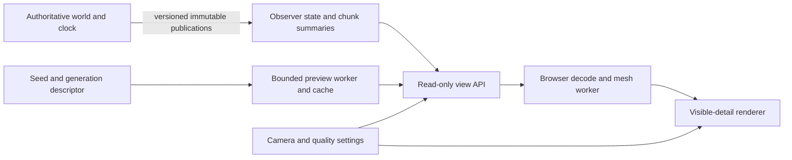

# A bounded planet observer — 8 October 2026

**Render only the detail that can contribute to the current view; keep authoritative simulation independent of the camera.** A whole-planet browser view does not require simulating or downloading all five trillion surface cells. It needs shared coordinates, explicit data provenance, bounded caches and a readable transition between geographic overview and actual local material.

This review combines [the scale contract](scale-audit.md), the current Canvas renderer, `PlanetWelcome`, the atlas and observer API. It also considers four prospective 300-person camps: **1,200 initial inhabitants**, with further births possible. [The founding critique](300-person-founding.md) treats their physical resources separately from how many details a browser displays.

## Foundations and evidence

The relevant premodern connection is surveying and material geometry: Vitruvius distinguishes loads and supporting ground; Agricola distinguishes shafts, tunnels, removed material and connected routes (`A11`, `A12`). A plan, perspective or section must refer to the same place and quantity. Neither source determines a browser architecture or frame budget.

Modern platform documentation supplies the rendering constraints. MDN recommends reusing static drawing, separating update frequencies, budgeting graphics resources, batching draw calls and avoiding synchronous GPU stalls (`M11`, `M12`). Animation callbacks follow display refresh, not simulation time (`M13`). Workers and transferable canvases can move some work off the UI thread but do not remove its cost (`M14`). Long-task observation is useful where supported, with a 50 ms reporting threshold rather than a universal acceptable delay (`M15`). These consulted passages are listed in the [source register](source-register.json).

The [measurement record](rendering-review.json) preserves actual isolated-browser results, source fingerprints and proposed budgets. The [repeatable probe](renderer-probe.mjs) creates no world, server or database:

```sh
node docs/research/renderer-probe.mjs /tmp/praxans-render-report.json
```

The probe uses the repository's Playwright browser and bundles the current renderer in memory. It checks its actual color helper, terrain-cache invalidation and offscreen projection work. Its synthetic 96 × 96 meadow has no population or structures and an 800 × 600 CSS-pixel canvas at DPR 1. One warm-up precedes five forced redraw submissions. These are JavaScript timings, not GPU completion, end-to-end FPS, an ordinary-PC certification or a simulation benchmark.

## Concrete findings and the revision examined

| Finding in the original inspected implementation                | Evidence                                                                                                                     | Disposition in this batch                                                                                                                             |
| --------------------------------------------------------------- | ---------------------------------------------------------------------------------------------------------------------------- | ----------------------------------------------------------------------------------------------------------------------------------------------------- |
| `mix` emits `rgb(...)` but nested calls parse hex               | `rgb(191,166,125)` became `rgb(NaN,23,32)`; Canvas retained the preceding `#112233` fill.                                    | Collaborator revision produced valid `#ab9873` shading in the isolated probe.                                                                         |
| Any new structures-array identity dirties all terrain           | Equal-content new arrays set `terrainDirty=true`; every SSE frame reconstructs that array.                                   | Revised probe leaves the cache clean for an equal new array.                                                                                          |
| Offscreen terrain still incurs full traversal/projection        | A view translated a million pixels away still made 46,080 projection calls for 9,216 cells.                                  | Revised probe makes zero projection calls in that case.                                                                                               |
| Flat right-neighbor indexing crosses row boundaries             | Requested cell `(96,0)` read `(0,1)` in a 96-wide array.                                                                     | Collaborator reports bounds-checked lookup correction; not independently exercised by the revised probe.                                              |
| Canvas redraw and object work are not bounded by visible detail | Original terrain copied/sorted all cells; all citizens were sorted/drawn, with repeated global population scans.             | Collaborator reports visible diagonal traversal, entity culling and draw-order/population caches. Full populated-view timing remains unmeasured here. |
| Construction and ground have inconsistent drawn scale           | Surface projection gives 1 horizontal pixel per metre along a tile axis; component factor `s=5` gives five times that scale. | Still an explicit scale/view contract issue. Preserve artistic glyphs only with a clear distinction from dimensioned material geometry.               |

Original CLI measurement used Headless Chrome 144 and recorded 49–81.9 ms submissions. The later probe used Chrome 153, so those numbers must not be treated as a controlled comparison. A frozen-original rerun under Chrome 153 recorded **39.1–115.3 ms, median 51.6 ms**; the examined revision recorded **76.1–99.2 ms, median 92.1 ms**. Five sequential samples under concurrent host load do not establish a speed improvement. The deterministic cache, color and offscreen-work changes are established by this fixture; forced full-redraw speed still needs a discriminating measurement.

The collaborator also reports bounded raster backing, capped animation, hidden/reduced-motion handling and offscreen entity culling. The probe does not test all these behaviors. The original globe already caps DPR at 1.6, draws at approximately 30 Hz (10 Hz for reduced motion), skips hidden documents, reuses geometry and disposes resources on normal unmount. Keep those useful properties.

## Current data boundaries

The observer's terrain snapshot is **96 × 96 cells**, chosen from a community-dependent origin. Panning does not request a new geographic window. `PlanetWelcome` supports orbiting and an enter-world button, but has no coordinate-preserving zoom from a selected globe point into its local terrain.

Every original SSE frame carries global arrays of citizens, animals, structures and caravans, plus diplomacy, events/history and agents, even though its terrain is local. At target clock speed, broadcasts are roughly hourly in simulation/about once per real second, and terrain changes are included every fourth broadcast. Multiple streams with the same origin reuse serialized frame strings, and slow streams are bounded/disconnected. Those are useful limits, but larger populations still enlarge every frame and much of the UI work.

The atlas is **1024 × 512 RGBA**, 2 MiB before transport overhead and approximately 2.67 MiB with a complete uncompressed mip chain. Near 45° latitude, one texel spans about **27.64 km east–west and 39.09 km north–south**. It cannot display a 120 m habitat or distinguish individual land plants. Its source samples saved terrain where present and the seeded surface field otherwise; a 3 × 3 weighted filter suppresses subpixel patterning. The result is cached for the runtime's lifetime and served with a one-hour browser cache lifetime.

The first atlas request synchronously generates 524,288 samples and filters them inside the same runtime process that runs the authoritative clock. The public gateway is a separate process, but it forwards this work to that runtime. No cold-atlas latency was measured in this batch. Enlarging or repeatedly regenerating such views there is an avoidable source of clock/I/O backlog.

Existing snapshot and atlas reads **do not materialize land**. Longitude/latitude conversion and globe pin orientation derive from the same surface helpers. Preserve those contracts. The planetary atlas is an overview of geography, not a complete live ecological map; future live coverage and timestamps should make that distinction legible without exposing server implementation details.

## One view contract, several levels of detail

Use the same geographic anchor throughout: world ID, normalized longitude/latitude, surface coordinates, physical height/depth and an explicit geometry version. Camera zoom, projection and visual exaggeration are observer settings. Rendering resolution is separate from physical resolution.

| View               | Data and geometry to request                                                          | What the user can meaningfully inspect                                                                              |
| ------------------ | ------------------------------------------------------------------------------------- | ------------------------------------------------------------------------------------------------------------------- |
| Planet/orbit       | Low-resolution terrain atlas, celestial state, sparse community/live-coverage markers | Continents, seasons and where recorded habitats exist.                                                              |
| Continent/biome    | A bounded geographic texture/mesh pyramid with declared source and revision           | Regional relief and materialized coverage, without inventing fine ecology.                                          |
| Local habitat      | Visible saved chunks plus a small margin; compact cell and visible-entity records     | Actual surface water, plants, people, structures and their recorded changes.                                        |
| Structure/material | Selected assembly components and nearby physical terrain at actual dimensions         | Geometry, loads, volume and represented material properties. Magnification adds no physical detail by itself.       |
| Cutaway/subsurface | Only represented depth layers, cavities and components when P14/P15 supply them       | Sections at a named depth and connected openings; absent geology must not be depicted as discovered or excavatable. |

A geographic texture pyramid can use two equirectangular root patches and wrap longitude, while local live chunks retain their existing coordinate IDs. All transitions must use the canonical conversion helpers, including the 45° equal-area metric and seam/polar cases identified in the scale audit. Start with adapters between the existing globe and local renderer; a complete rendering-engine rewrite is not a prerequisite for selecting a globe location and requesting a bounded local view.

Use camera-relative coordinates for fine geometry. A 32-bit float near Earth's radius has roughly **0.5 m** spacing; near one astronomical unit it has roughly **16,384 m** spacing. Millimetre geometry cannot be uploaded as one enormous absolute coordinate and remain precise. Keep authoritative/geographic coordinates in their declared representation, subtract a local origin before sending fine vertices to the GPU, and shift the origin without changing identities, mass, collision state or history. A normalized unit sphere is already appropriate for the broad globe view.

For readability, retain the existing restrained palette, distinguish water/land and seasonal state, limit labels to the selected scale, and keep night observations legible. Show a physical scale bar for the current latitude and view. More trees, particles or invented microscopic textures are not substitutes for accurate quantities. If a glyph is enlarged to remain visible, its inspector and dimensioned close view must still use real metres.

## Separate authoritative state, observation and pixels



There is deliberately no camera-to-simulation-update edge. Agent proposals keep their existing authorized command path. Physical ecological refinement, if introduced, follows P16's conservation contract and simulation needs; drawing a finer mesh does not invoke it.

The smallest protocol increment is a bounded geographic view request rather than only a community selector. Retain a maximum footprint comparable to the current nine local chunks initially. Return an envelope with world ID, snapshot/base tick, origin/bounds, detail kind, projection/geometry version and chunk revisions. Explicitly distinguish seeded preview, saved live state, and unknown/unrepresented content. Reject or resynchronize incompatible/stale deltas rather than applying them to a different origin.

Publish compact visual records once per revision; request rich person, material or institution detail when selected. A world-wide community summary can contain counts and markers while individual drawing follows the visible domain. For 300-person agent observations, provide local aggregate needs/distributions plus paginated, addressable people; do not require every person's full memory in every response. Summaries must expose their scope and omissions, and aggregates must not replace the actual inhabitants in authoritative state.

Previews should be pure products of seed, generation version, geometry version, style and patch key. Generate/cache them outside the writer's event loop. Saved terrain overlays additionally require world ID and chunk revision/tick. Do not mix first-request live colors into an indefinitely cached base without recording their date/source. Coarse colored tiles are views over state, not another owned material reservoir.

## Bounded rendering and cache work

Select detail from screen contribution, with hysteresis so small camera movements do not repeatedly load and discard levels. Draw visible terrain first, then a small predictive margin. Batch similar geometry/materials, reuse buffers, and avoid per-frame sorting, global searches, text measurement and color parsing when inputs have not changed. Depth order and label placement can have their own revision caches.

Decode, aggregate and build meshes in a worker where supported; transfer owned typed buffers rather than clone entire worlds. Keep a main-thread fallback that processes bounded chunks of work. A worker is not a justification for unlimited requests or cache growth. Cancel obsolete view jobs, cap in-flight work and use byte-aware eviction with explicit disposal of textures, buffers and image bitmaps.

Two 1920 × 1080 RGBA canvas backing stores at DPR 2 alone account for **63.28 MiB** of raw pixels, excluding compositor copies, depth, multisampling, textures and other browser storage. A 256 × 256 RGBA tile with mipmaps uses approximately **341 KiB**, before metadata. Count these bytes rather than treating texture dimensions or tile counts as free. WebGL does not offer a portable complete-VRAM query.

The following are **proposed starting budgets**, not measured hardware guarantees:

| Budget                        | Initial bounded target                                         | Adaptation                                                                                     |
| ----------------------------- | -------------------------------------------------------------- | ---------------------------------------------------------------------------------------------- |
| Display cadence               | 30 Hz default during motion; 60 Hz only with measured headroom | Respect reduced motion; idle views render on relevant change; hidden views stop decoration.    |
| Frame interval                | 33.33 ms at 30 Hz; 16.67 ms at 60 Hz                           | Reserve time for input/layout/GPU work; do not consume the whole interval in JavaScript.       |
| Main-thread renderer work     | p95 ≤ 8 ms during a representative navigation trace            | Lower detail/update frequency before creating repeated long tasks. This target is unvalidated. |
| Drawing-buffer pixels         | At most 4 million; initial DPR cap 1.5                         | Reduce backing resolution while retaining readable DOM controls.                               |
| Renderer-owned CPU data/cache | 64 MiB baseline; a tested higher tier may allow 128 MiB        | Account for decoded and in-flight buffers; measure actual process growth separately.           |
| Estimated GPU allocations     | 64 MiB baseline; a tested higher tier may allow 128 MiB        | Scale with drawing pixels and device tests; evict/dispose above the cap.                       |
| In-flight view jobs           | Four requests, one current view generation                     | Abort superseded work and avoid duplicate patch requests.                                      |
| Initial live-detail domain    | Nine chunks plus separately bounded summaries                  | Do not stream every inhabitant because a distant region exists.                                |

Measure rolling frame/input timings with hysteresis; lower raster resolution, foliage detail, label density, then update cadence as needed. Restore quality slowly after sustained headroom. None of these settings may change simulated time, resource quantities, inhabitant actions, access to information, or recorded outcomes. GPU/context loss should recover from cached/versioned state or offer a clear low-detail fallback.

## Regular coherence review

The parent-supplied baseline scan inventoried **844 Git-visible files**, reporting zero missing imports, zero simulation→server/client import violations and zero broken local Markdown links. It was not independently rerun by this research batch. Those results establish useful structural consistency; they do not detect the color, scale, cache or demographic errors above.

At every meaningful development batch and before a release, record a dated review with source fingerprint, scope, findings, disposition and unresolved questions. The bounded scan should combine:

- Import/module boundaries and local-link checks, reusing the existing scan rather than inventing duplicate versions.
- Quantity contracts across simulation types, API DTOs, renderer units, inspectors and documentation.
- Snapshot/delta origin, version, time and cache compatibility; preview versus saved-state provenance.
- Pool ownership and migrations; no camera-triggered materialization or resources introduced by visual detail.
- Population scaling in full-array scans, transport size, agent observations and demographic assumptions.
- One representative browser navigation trace and the small regression fixtures affected by the actual change.

Maintain a requirement-to-code-to-check map; compare canonical constants rather than copying new numerical laws into the renderer. A passing import scan is not a declaration of whole-repository correctness. This is a proposed recurring review process, not an installed scheduler.

## Bounded delivery sequence

1. Finish and measure the current renderer corrections (`R17`): valid materials, real cache reuse, visible bounds, edge correctness, hidden/reduced-motion behavior. Preserve the baseline and avoid an unsupported speedup claim.
2. Add a geographic view envelope and coordinate-preserving globe→local selection (`R18`), with bounded live chunks and clear preview provenance. Check five latitudes, the seam and return navigation at identical anchors.
3. Enforce byte/work budgets and adaptive quality (`R19`). Measure a fixed trace on an ordinary integrated-GPU laptop/desktop in current Chrome and Firefox, at 1366 × 768 DPR 1 and 1920 × 1080 with scaling. These target-device runs have not occurred here.
4. Run the coherence review (`R20`) and the 300-person resource/observation checks (`R21`) against the concrete implementation. Depth views remain dependent on P14/P15, not a graphical imitation of absent volumes.

Source pages for two attempted Three.js manual URLs returned 404 and are not cited. No live world was read or changed, no survival ensemble ran, and no physics/client/server source was edited by this research batch. The renderer implementation and recovery remain the parent collaborator's work.
