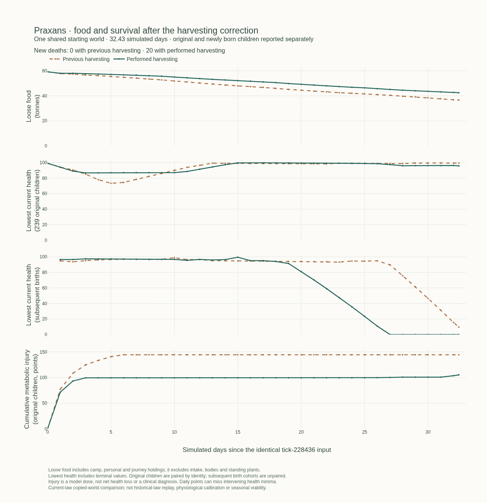

# Survival after the harvesting correction — 9 October 2026

The [historical collapse investigation](community-collapse-2026-10-08.md) established defects, including an exactly reproduced infant cold death with no available caregiver-wrapping action. This follow-up asks what happens under the corrected systems. It does not replace that historical evidence or classify the old extinction as natural.

The paired **32.427-day comparison is complete and does not validate demographic viability**. The preceding-harvest copy has no deaths; the performed-harvest copy has **20 deaths, all in Amber Hollow: four subsequent newborns and sixteen starting adults**. Both have 80 ordinary births. Global harvest increases 27.57%, but Amber Hollow harvest falls 7.28% and its food runs low earlier. The original 239 children survive in both copies; this favorable cohort result conceals the newer children's deterioration and adult deaths.

## Method and scope

Both arms start at tick 228436 from the same independently hashed inhabited checkpoint: 1,200 renewed adults and 239 children under one year. The preceding harvesting implementation is pinned to `0db99d59905ad26bc6f1330a17f4e0d2ec479b6f`; the performed-harvest implementation to `19570a9424a7a3517107f7547a2b7f856945802d`. Each bundle pins the complete committed source tree, including JSON dependencies. The full interacting world and overlapping catchments stay together.

Both arms already include the earlier care, food-allocation, metabolism and developmental corrections. Consequently, this is a current-law transition-state comparison, not a replay of the laws that killed the historical communities. The inherited oversized children remain unchanged, and the migration initializes empty intake rather than inventing past meals. Subsequent newborns form a separate cohort.

The eight-day runs use unmodified simulation functions, whole-tick observation and daily independently hashed checkpoints. Each first day exactly matches the earlier uninstrumented complete-world digest. The continuation replays an overlapping day to test restart behavior, including the separate before-save and after-save digests and cumulative child observations. Saving archives pending journal events; those boundaries must not be mixed.

Selected-day phase replays add read-only hooks around original operations. Their acceptance requires both the reference complete-world digest and declared accounting tolerances: food/intake/body reconciliation, complete health stages and disjoint holder-phase closure. The observer copies the actual post-wear preparation conditions before people and tiles change. Care occurs after that interval's physiology; newly placed fiber cannot explain earlier heat loss. The original 239 children are paired by identity; new births are not paired merely because an ID or birth count happens to match.

These are individual model trajectories, not a randomized ensemble or human physiological calibration. Work changes subsequent encounters and shared RNG consumption, so a different illness history is not automatically a direct physiological effect of harvesting. The previously consulted Hippocratic locality questions (A03) and Xenophon's provision/practice questions (A04) in the [source register](source-register.json) motivate separate accounts of surroundings, supplies and performed care. No new historical reading or empirical parameter fit is claimed here.

## Completed comparison to the historical first-death date

Both arms reach tick **231549**, with their source checkpoints unchanged. Each continuation replays day eight exactly: full pre-save world, post-save world, cumulative child records and community food flows match the uninterrupted arm. The continuation compute ceilings are 35 minutes each; both finish within them. The historical first-death date is the declared endpoint, not a required death outcome or a statement that the replay uses historical laws.

| Measured quantity, 32.427 days | Previous harvesting | Performed harvesting |
|---|---:|---:|
| Final population | 1,519 | 1,499 |
| Ordinary births | 80 | 80 |
| New deaths | 0 | 20 |
| Deaths among starting adults / original children / later births | 0 / 0 / 0 | 16 / 0 / 4 |
| Actual food harvest, kg | 22,715.884 | 28,978.416 |
| Food oxidized, kg | 36,570.020 | 36,373.428 |
| Body reserves oxidized, kg | 0.367 | 329.567 |
| Change in loose food, kg | −22,665.924 | −16,723.490 |
| Metabolic injury, original 239 children, points | 144.545 | 105.341 |
| Mean final health, original children | 99.984 | 99.947 |
| Mean final health, later births including deaths | 97.410 | 90.502 |

The current arm has worse mortality in this paired trajectory despite greater global production. Food oxidation excludes reserve use; a smaller food-only total is not evidence of more efficient living. Nor is the preceding arm healthy merely because its first death falls outside this observation: its weakest newborn ends at 9.697 health and Amber Hollow's communal food is empty.

The same original children contribute 186,001.75 observed child-hours in either arm. Their measured metabolic injury is 27.12% lower with performed harvesting, while final health improves for 55, worsens for 55 and is equal within `1e-9` for 129. The subsequent-birth cohorts have different individuals and exposure histories: 30,060 / 29,754.75 child-hours, 80 / 76 survivors, and 403.046 / 898.594 cumulative metabolic injury points. They are not paired by reused identifiers or equal birth counts.

| Community | Harvest before → current, kg | Final communal food before → current, kg | New deaths before → current |
|---|---:|---:|---:|
| Fernhaven | 5,643.431 → 8,517.310 | 1,202.418 → 3,835.840 | 0 → 0 |
| Amber Hollow | 5,789.307 → 5,367.602 | 0 → 0 | 0 → 20 |
| Stonebrook | 4,601.782 → 6,411.190 | 6,407.282 → 8,040.586 | 0 → 0 |
| Adonis | 6,681.365 → 8,682.314 | 25,228.665 → 27,037.184 | 0 → 0 |

Amber's first end-of-day sample below 5 kg communal food is day 28 before and day 24 after; these daily observations do not identify the first instant of scarcity. Its final carried food is 330.479 / 197.669 kg. The remaining material is held by particular people, not automatically available at every place. Larger stores elsewhere and overlapping standing vegetation cannot be counted as food delivered to this community.

The [vector figure](survival-continuation-2026-10-09.svg) retains terminal child values instead of dropping people when they die. Daily plotted points can miss intervening minima. Adult deaths are included in the headline count and table; the two health panels explicitly show the child cohorts. Full quantities, identities, source/checkpoint/trace hashes and acceptance checks are in the [derived evidence](survival-continuation-2026-10-09.json).

## Completed eight-day comparison

Each arm ends at tick 229204. One tick is 15 simulated minutes; eight days contain 768 ticks. The initial compute ceiling was 900 seconds per arm; both reached their target with the source file unchanged.

| Measured quantity | Previous harvesting | Performed harvesting |
|---|---:|---:|
| Final population | 1,456 | 1,456 |
| New births / new deaths | 17 / 0 | 17 / 0 |
| Actual food harvest, kg | 6,526.966 | 9,337.848 |
| Food oxidized, kg | 8,812.180 | 8,855.586 |
| Change in loose food, kg | −5,809.958 | −3,150.910 |
| Metabolic injury in original 239 children, points | 144.545 | 99.453 |
| Mean final health, original children | 99.786 | 99.925 |
| Lowest health reached by an original child | 72.993 | 86.691 |

Harvest rises **43.07%** and the original cohort's measured metabolic injury falls **31.20%**. The cohort has exactly 45,888 measured child-hours in either arm. These injury points sum actual losses across intervals; they are not a count of affected children, net health loss, or a clinical scale.

Final health improves for **59** original children, worsens for **53**, and is equal within `1e-9` for **127**. Jun Brook is the largest adverse endpoint difference: **93.717 → 87.014**, a loss of **6.703** points between arms. Before, Remi Alder reaches the original cohort's lowest health, 72.993, then recovers to 82.195. After, Jun reaches 86.691 and ends at 87.014. A minimum among surviving people alone could hide earlier injuries or deaths; cumulative identities and terminal values are retained.

The 17 subsequent births each arm also survive this window. Their cumulative metabolic injuries are 33.846 and 30.083 points, respectively. They have different identities and care histories and are reported separately. Survival for days is not proof of founding viability, a complete lean season, or generational continuity.

## Food and protection are distinct constraints

Across eight days, the current arm harvests slightly more food than it oxidizes, yet loses 3.151 tonnes of loose food. Initial intake filling, inventory decay, bodily construction at birth and other material uses must also be accounted for. A net stock decline is not a direct measurement of spoilage. Delivery, ration pickup and handoffs change holders; they do not create another harvest.

Community outcomes differ. Fernhaven's loose food increases by 163.397 kg under the current rules. Amber Hollow still harvests only 1,492.197 kg against 2,208.453 kg oxidized, and ends with 2,160.971 kg in camp stock. Adonis retains a much larger store but loses 1,690.111 kg of loose food. The three nearby communities share much of their surrounding land; their catchment inventories cannot be added as independent supply or treated as annual edible production.

The accepted first-day phase replays find **2,372 / 2,205** injured child intervals under preceding/current harvesting. In every one, food funds the maximum permitted oxidation rate, without a material oxygen or maintenance shortfall. No child's requested food remains unfilled. The injury comes from the remaining cold deficit, totaling 19,870.180 / 17,918.512 kJ. This localizes the model's injury mechanism for those days. It does not establish that the effective power, heat-exchange or injury coefficients are biologically correct.

Ada Stone's first-day food requests are fully met. Her health changes by −3.542 through metabolism, −2.880 through illness and +0.528 through recovery, with no performed covering transfer. The endpoint alone would not distinguish these processes.

Ida Hollow receives 0.684 kg of covering in the preceding-rule day and none in the current-rule day. Her food ingestion increases, but cold injury rises from 2.110 to 3.833 points; illness damage is identical. Conversely, Lumi Moss's slightly lower cold injury accompanies newly recorded illness. Neither case supports equating more food production with uniformly better child health. These are observed coupled paths, not isolated counterfactual effects of a particular caregiver's choice.

Jun's accepted day-three replay localizes the adverse timing. The preceding arm starts already wrapped, with zero metabolic injury that day. The current arm starts bare and incurs 45 intervals of cold injury despite fully funded maximum oxidation. At tick 228696 he still has 0.14108 kg intake and 2.99935 kg provisions. Three helpers place the first 0.278799 kg fiber **after** that interval's physiology. The next preparation, at 228697, sees the protection; no subsequent cold injury occurs in that day. Total gross placement is 0.739562 kg. Both states remain inactive, at one location and unsheltered, with nearly equal mean local temperature. This identifies an observed protection/timing mechanism without establishing why help arrived later or the independent effect of compelling earlier care.

The first-day loose-food residual also closes beyond ingestion and harvesting. Before: **−358.017391 kg = −351.652814 decay −4.000000 birth transfer −2.364577 other people-phase use**. After: **−358.332612 kg = −352.637563 decay −4.000000 birth transfer −1.695049 other people-phase use**. The small remaining people-phase use is unclassified by these hooks; it must not be labeled additional spoilage. These exact one-day decompositions cannot be extrapolated into measured loss totals for the longer continuation.

## Newborn stress in the preceding-rule continuation

The preceding-rule arm reaches the declared tick 231549: **1,519 people, 80 subsequent births and no new deaths**. This endpoint conceals severe deterioration in two new Amber Hollow children. Ivo Birch falls from 98 to **9.697** health over 143.25 observed hours. His entire 88.303-point loss is measured metabolic injury, with 21,192.632 kJ of cold deficit and zero unmet maintenance. Dara Aster ends at **12.736** after 78.994 metabolic injury points and a further net 6.270 points from other processes. They remain alive at this endpoint; a later death has not been observed by this run.

Day 29 was selected for additional tracing **after** this deterioration appeared. Its 96-tick replay matches the complete uninstrumented reference and all accounting guards. Ivo and Dara each oxidize 0.475795 kg food, use no reserves, and lose 14.400 / 14.477 health through cold that day. Neither receives a recorded covering transfer. Yara Stone starts with protection, has no metabolic injury and recovers 3.319 points. This comparison localizes observed conditions; it is not a controlled estimate of compelling earlier care.

At day 28, Amber Hollow has only 3.840 kg communal food and **0.100 kg communal fiber**, although private food remains. The babies have provisions and occupy different cells from their parents in that checkpoint. Current newborn placement, independently assigned resting places, local contact and competing food/material work are relevant mechanisms to examine. A missing transfer alone does not reveal whether a particular helper lacked contact, material, willingness or time.

The surveyed standing-edible proxy in Amber Hollow's connected catchment rises from 44.926 to 50.151 tonnes over the preceding-rule continuation, while its communal food nearly runs out. That proxy is a calculation from represented plant carbon, minerals, woodiness and defense. It is neither harvested food nor a measured sustainable yield, and much of the land is shared with neighboring communities. The trajectory therefore does not demonstrate that all nearby vegetation was exhausted, or that all of it was known and usable by residents.

## Current-rule infant death, reproduced at the actual physiological boundary

Rowan Finch dies at tick **231013**, 26.844 days after the input and about 8.385 days after birth. A separate replay of day 27, ticks 230932–231028, matches the complete uninstrumented final world and all accounting guards. It records his 81 physiological intervals before death, including the terminal interval. He remains stationary, bare and unsheltered, with finite provisions; every interval funds the model's maximum oxidation from food. No covering effort or transfer reaches him in this window.

At the fatal preparation the local temperature is **7.267830°C**. His 15-minute heat loss is **118.803758 kJ**, against **79.200000 kJ** released. Maintenance and oxygen are satisfied; sickness, dehydration and recovery contribute no health change. `finishMetabolism` reduces his remaining **0.014169** health to zero. The later death-event temperature, 7.274548°C, is a different observation boundary. The raw cold dose is 0.165016 points, but actual loss is clipped to the remaining health; multiplying clipped loss by 240 would underestimate the physical deficit.

This does not establish that every child has adequate food. Another newborn in the same replay has 52 injured intervals: only 14 are funded at the food oxidation cap, while 38 fall below it and use finite reserves. Source access, protection and the body's permitted power are distinct constraints. The observed cold mechanism is exact within the model; its effective skin temperature, body-area floor, maximum power and injury dose are still uncalibrated human physiology.

## Adult deaths: depleted bodies, failed access and a contact exclusion

The accepted current-rule day-32 replay covers all sixteen adult deaths, at ticks **231471–231504**. Their 1,180 observed intervals total 295 person-hours, stopping at each person's death. Throughout these intervals they have no intake, usable reserves or provisions, oxidize no food, release no metabolic energy and receive no food or covering transfer. All sixteen reach zero health during metabolism. Their combined 681.446-point loss includes 674.486 measured metabolic injury and 6.960 earlier sickness injury in four adults; these stages must not be conflated.

Every one of their captured food claims selects no shared source. For these non-journey residents, the pinned `feedIntake` code makes that an access failure: `canReachCampStocks` is false, independently of how much food the camp holds. Meanwhile, other Amber Hollow residents ingest **186.736 kg** during the day. Existing food belongs to particular holders at particular locations; a community total cannot establish a starving person's access.

All sixteen remain at unchanged positions with unfinished **rest routes** and zero funded movement. There is a concrete contact-rule problem: `stationary` in `bodywork.ts` rejects a person with any pending path, even when that person has not moved. `foodwork.ts` uses this check both to find recipients and to commit handoffs. These physically stranded people are therefore excluded from the local help operation by their pending route. The trace does not record the presence, supplies or willingness of potential donors, so this exclusion is established without claiming it independently caused all sixteen deaths or that changing it would rescue them.

The smallest next control is a finite, willing, co-located donor and a fuel-depleted recipient: compare the same motionless recipient with an unfinished route versus an explicitly stopped task. Keep donor work, material debits, later ingestion and actual-movement rejection intact. That control has not yet run. A separate planned-activity calculation also exceeds resting/thermal demand in 165 zero-work intervals; its largest additional raw injury dose is 0.017573 points per interval. This is an accounting question for a controlled comparison, not an independently measured share of mortality.

The last-day trace does not establish when their food reserves ran out, how the changing camp footprint affected earlier access, or which routes and decisions stranded them. Those preceding events and actual donor opportunities remain necessary to distinguish poor choices, scarcity and further implementation defects.

## Remaining questions and live status

The adverse whole-world result and the contrasting cold/food terminal states make local production, logistics and care the next questions. A global harvest increase does not answer why Amber obtains less food, why particular people cannot receive it, or why protection fails to reach a newborn. The selected phase windows follow observed failures; they are case investigations, not independently randomized treatment comparisons.

The next bounded test targets the stranded-recipient exclusion, followed by actual local acquisition and care opportunities. Infant heat/development calibration and the difference between exposure, illness and starvation remain essential. Realistic mobility, attachment and feeding require connected mechanisms; making infants immobile without a carrying/care path could introduce a new access defect. Increasing food, forcing generosity or guaranteeing survival would not isolate these questions.

This research changes no live inhabitants, resources, clock or law. The four historical live communities remain extinct and the previously published [performed-harvest release](../releases/performed-harvesting-0.2.md) remains the deployed physical implementation. The read-only 12:08 UTC runtime/metadata check finds one running writer, saved tick 610536, nine archive records and unchanged historical totals of 407 births / 1,639 deaths. Gateway-local health is healthy and still catching up, with 2,614 seconds of clock debt. This check is separate from the release's earlier independent backup and complete archive-byte verification.

## Repository review and evidence limits

The 12:27 UTC structural review covers 985 Git-visible files, including 141 JavaScript/TypeScript files and all 82 runtime source files. It resolves 746 local import/asset edges and checks 617 local Markdown targets, with no missing target or forbidden client/server/simulation dependency. Two nonliteral imports in the historical replay remain outside static resolution. Runtime source bytes are unchanged: SHA-256 `1553aa55d7f1aabd9072cc6fff3a33d73115aa97f0e2477081042dd59d24705a`.

The semantic review corrects stale research statuses, replaces a completed continuation's obsolete next-step text and places harvesting with the runtime systems in the registry. It distinguishes standing plants, loose stocks, private custody, ingestion and oxidation; planned versus performed movement; physiological versus end-of-tick observations; and historical versus current-law deaths. The newly exposed contact exclusion remains an implementation issue, not a passed acceptance criterion.

This scan does not validate Markdown anchors, arbitrary runtime paths, all legacy Python behavior or scientific adequacy. The accepted model replays and accounting checks establish reproducibility within their declared scope. Private diagnostic runners and saved-world checkpoints remain outside Git; the public derived record provides hashes and quantities, not a self-contained replay package or ownership records.
